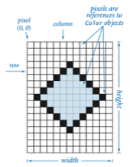
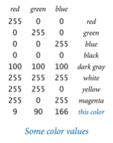
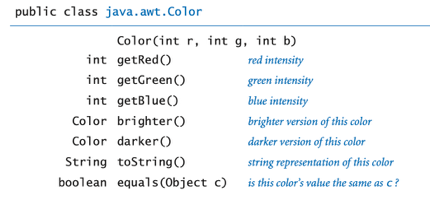
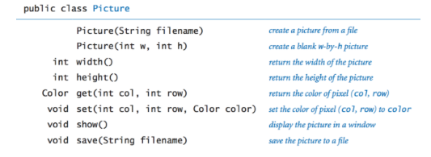
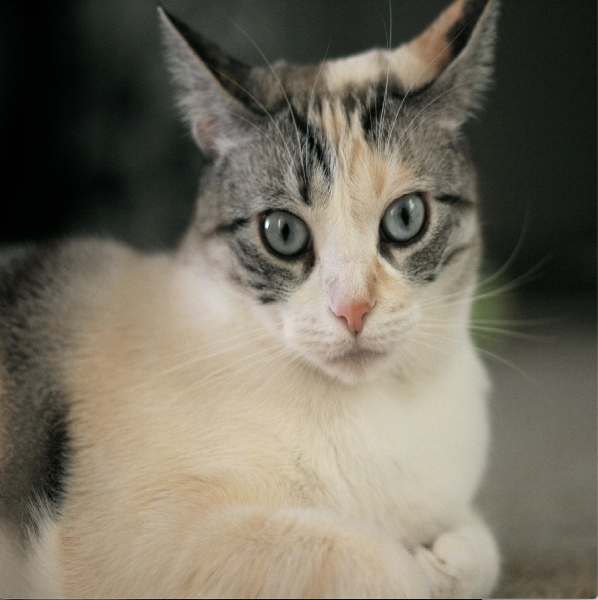
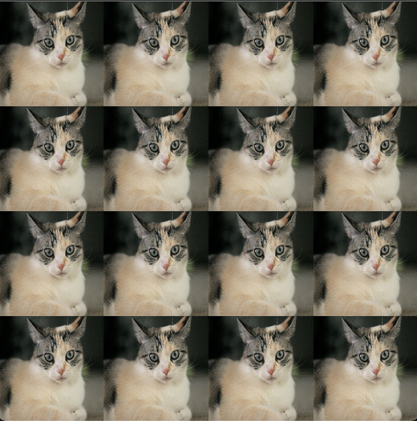
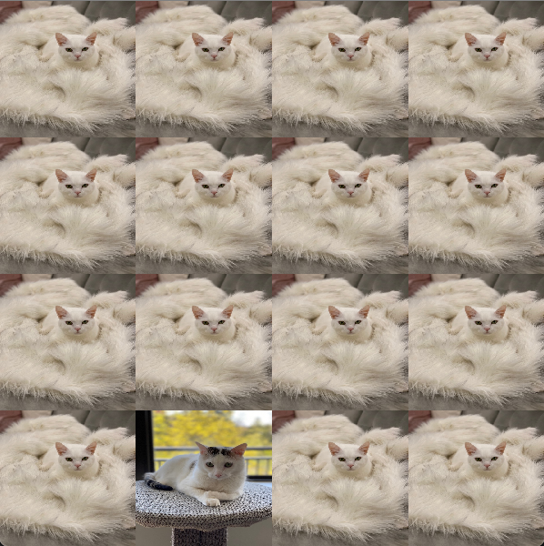
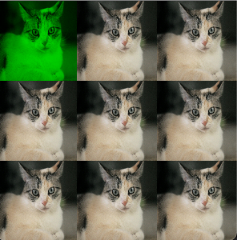
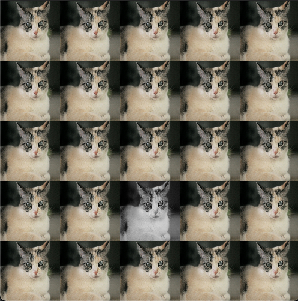

# Programming Assignment - Art Collage

This assignment you will create a collage of images.

Refer to our [Programming Assignments FAQ](https://ds.cs.rutgers.edu/assignment-faq/) for instructions on how to install VSCode, how to use the command line and how to submit your assignments.

## Overview

The goal of this assignment is to perform several operations on digital images.

Your cellphone contain computers with lenses and light-sensitive devices capable of capturing images in digital form, and your computer has photo-editing software that allows you to process those images. You can crop them, enlarge and reduce them, adjust the contrast, brighten or darken them, remove red eye, and a myriad of other operations. Many such operations are easy to implement, given a simple data type that captures the idea of a digital image.

## Digital Image

A digital image is a rectangular grid of pixels (picture elements), where the color of each pixel is individually defined.

An image can be represented as a 2D array where each array cell has a color.



Color is a sensation in the eye from electromagnetic radiation. Since we want to view and manipulate color images on our computers, color is a widely used abstraction in computer graphics, and Java provides a [`Color`](https://docs.oracle.com/en/java/javase/18/docs/api/java.desktop/java/awt/Color.html) data type.

## Color

To present color values, `Color` uses the RGB color model that represent the intensity of the red, green, and blue components of the color. Other color values are obtained by mixing red, green, and blue components. That is, the data-type values of `Color` are three integer values.



```java
import java.awt.Color;

public class Example {
    public static void main(String[] args) {
        // The Color data type has a constructor that
        // takes three integer arguments.
        Color bookBlue = new Color(9, 90, 166);
        System.out.println("Red component " + bookBlue.getRed());
        System.out.println("Green component " + bookBlue.getGreen());
        System.out.println("Blue component " + bookBlue.getBlue());
    }
}
```

The API for `Color` contains several constructors and methods; three of the methods enables the programmer to retrieve the `Color` components intensity separately.



## Picture

The [`Picture`](https://introcs.cs.princeton.edu/java/stdlib/Picture.java.html) class from the [Introduction to Computer Science book](https://introcs.cs.princeton.edu/java/home/) is a data type for digital images whose definition follows from the digital image abstraction (see Digital Image above). The set of values is a two-dimension array of `Color` values, and the operations is what you would expect.



By convention, `(0,0)` is the upper-leftmost pixel, so the image is laid as in the customary order for two-dimensional arrays. The supported file formats for the first constructor are PNG and JPEG formats.

## Implementation

### Overview of Files

-   `Picture`, which is described above (from CS111). Do not edit this class.
-   `Collage`, which contains some provided methods in addition to annotated method signatures for all the methods you are expected to fill in. You will write your solutions in this file, and it is the file which will be submitted for grading.
-   `Driver`, which you can run to test any of your methods interactively. Feel free to edit this class, as it is provided only to help you test. It is not submitted, and it is not used to grade your code.
-   `StdIn`, which is used by the driver. Do not edit this class.
-   Multiple JPEG files that can be read by the driver as test cases. They are not submitted.

### Methods to be implemented by you in `Collage.java`

`Collage` keeps at all times two digital images as Pictures:

-   Original picture, which is the image from the input file without modification. Do not modify this image.
-   Collage picture, which is the image you will perform operations on.
    -   You are going to manipulate this image as if it is made up of tiles. The image has `collageDimension x collageDimension` tiles.
    -   Each tile is made of `tileDimension x tileDimension` pixels.

#### One-argument constructor

-   Set default values of collage dimension to `4` and tile dimension to `150`.
-   Initializes original picture with the filename image.
-   Initializes collage picture as a `Picture` of

    ```
    (tileDimension * collageDimension) x (tileDimension * collageDimension)
    ```

    where each pixel is black.

-   Update `collagePicture` to be a scaled version of original.

#### Three-arguments constructor

-   Set default values of collage dimension and tile dimension to argument values.
-   Initializes original picture with the filename image.
-   Initializes collage picture as a `Picture` of

    ```
    (tileDimension * collageDimension) x (tileDimension * collageDimension)
    ```

    where each pixel is black.

-   Update collage picture to be a scaled version of original picture.

#### `scale`

-   Used in both constructors.
-   Changes the size of a picture to fit into another.
-   How to scale? See the code [here](https://introcs.cs.princeton.edu/java/31datatype/Scale.java.html).
-   Running `scale`:

    ```
    Enter an image file => Ariel.jpeg


    Which method would you like to test? Methods 3-8 rely on the constructor previously chosen.
    1. one-argument constructor
    2. three-argument constructor
    3. showOriginalPicture
    4. showCollagePicture
    5. makeCollage
    6. replaceTile
    7. colorizeTile
    8. grayscaleTile


    Enter a number => 1

    What would you like to do now?
    1. Test new image file
    2. Test new method on the same image file
    3. Quit
    Enter a number => 2


    Which method would you like to test? Methods 3-8 rely on the constructor previously chosen.
    1. one-argument constructor
    2. three-argument constructor
    3. showOriginalPicture
    4. showCollagePicture
    5. makeCollage
    6. replaceTile
    7. colorizeTile
    8. grayscaleTile


    Enter a number => 4
    ```

-   Example of a scaled output:

    

    The original image (`Ariel.jpeg`) has 1536 rows x 1819 columns. The collage image that results from the one-argument constructor (on the left) has 600 rows by 600 columns.

    The scaling method made the original image smaller to fit into the collage picture size.

#### `makeCollage`

-   Make a tile of `tileDimension x tileDimension` pixels by scaling down the original picture.
-   Update the collage picture to be a collage of these tiles. Meaning, each tile is repeated in the image.
-   The collage picture will have `collageDimension x collageDimension` tiles.
-   Running `makeCollage`:

    ```
    Enter an image file => Ariel.jpeg


    Which method would you like to test? Methods 3-8 rely on the constructor previously chosen.
    1. one-argument constructor
    2. three-argument constructor
    3. showOriginalPicture
    4. showCollagePicture
    5. makeCollage
    6. replaceTile
    7. colorizeTile
    8. grayscaleTile


    Enter a number => 1

    What would you like to do now?
    1. Test new image file
    2. Test new method on the same image file
    3. Quit
    Enter a number => 2


    Which method would you like to test? Methods 3-8 rely on the constructor previously chosen.
    1. one-argument constructor
    2. three-argument constructor
    3. showOriginalPicture
    4. showCollagePicture
    5. makeCollage
    6. replaceTile
    7. colorizeTile
    8. grayscaleTile


    Enter a number => 5

    What would you like to do now?
    1. Test new image file
    2. Test new method on the same image file
    3. Quit
    Enter a number => 2


    Which method would you like to test? Methods 3-8 rely on the constructor previously chosen.
    1. one-argument constructor
    2. three-argument constructor
    3. showOriginalPicture
    4. showCollagePicture
    5. makeCollage
    6. replaceTile
    7. colorizeTile
    8. grayscaleTile


    Enter a number => 4

    What would you like to do now?
    1. Test new image file
    2. Test new method on the same image file
    3. Quit
    Enter a number =>
    ```

-   Example output:

    

#### `replaceTile`

-   Replaces a tile on the collage picture with another image.
-   Running `replaceTile`:

    ```
    Enter an image file => Ariel.jpeg


    Which method would you like to test? Methods 3-8 rely on the constructor previously chosen.
    1. one-argument constructor
    2. three-argument constructor
    3. showOriginalPicture
    4. showCollagePicture
    5. makeCollage
    6. replaceTile
    7. colorizeTile
    8. grayscaleTile


    Enter a number => 1

    What would you like to do now?
    1. Test new image file
    2. Test new method on the same image file
    3. Quit
    Enter a number => 2


    Which method would you like to test? Methods 3-8 rely on the constructor previously chosen.
    1. one-argument constructor
    2. three-argument constructor
    3. showOriginalPicture
    4. showCollagePicture
    5. makeCollage
    6. replaceTile
    7. colorizeTile
    8. grayscaleTile


    Enter a number => 5

    What would you like to do now?
    1. Test new image file
    2. Test new method on the same image file
    3. Quit
    Enter a number => 2


    Which method would you like to test? Methods 3-8 rely on the constructor previously chosen.
    1. one-argument constructor
    2. three-argument constructor
    3. showOriginalPicture
    4. showCollagePicture
    5. makeCollage
    6. replaceTile
    7. colorizeTile
    8. grayscaleTile


    Enter a number => 6


    Enter a new image file => Ploc.jpeg

    In which column is the tile would you like to replace? Enter a number => 1

    In which row is the tile would you like to replace? Enter a number => 3

    What would you like to do now?
    1. Test new image file
    2. Test new method on the same image file
    3. Quit
    Enter a number => 2


    Which method would you like to test? Methods 3-8 rely on the constructor previously chosen.
    1. one-argument constructor
    2. three-argument constructor
    3. showOriginalPicture
    4. showCollagePicture
    5. makeCollage
    6. replaceTile
    7. colorizeTile
    8. grayscaleTile


    Enter a number => 4
    ```

-   Example output:

    

#### `colorizeTile`

-   Colorizes a tile in the collage picture using red, green, or blue component.
-   For example, to colorize a tile green, for every pixel:

    1. Get the pixel's color's green intensity.
    2. Update/set the pixel with only its green component.

        ```java
        import java.awt.Color;

        public class Example {
            public void colorizeGreen(int col, int row) {
                Picture picture = new Picture("example.jpg");
                Color color = picture.get(col, row);
                int green = color.getGreen();
                picture.set(col, row, new Color(0, green, 0));
            }
        }
        ```

-   Running `colorizeTile`:

    ```
    Enter an image file => Ariel.jpeg


    Which method would you like to test? Methods 3-8 rely on the constructor previously chosen.
    1. one-argument constructor
    2. three-argument constructor
    3. showOriginalPicture
    4. showCollagePicture
    5. makeCollage
    6. replaceTile
    7. colorizeTile
    8. grayscaleTile


    Enter a number => 1

    What would you like to do now?
    1. Test new image file
    2. Test new method on the same image file
    3. Quit
    Enter a number => 2


    Which method would you like to test? Methods 3-8 rely on the constructor previously chosen.
    1. one-argument constructor
    2. three-argument constructor
    3. showOriginalPicture
    4. showCollagePicture
    5. makeCollage
    6. replaceTile
    7. colorizeTile
    8. grayscaleTile


    Enter a number => 5

    What would you like to do now?
    1. Test new image file
    2. Test new method on the same image file
    3. Quit
    Enter a number => 2


    Which method would you like to test? Methods 3-8 rely on the constructor previously chosen.
    1. one-argument constructor
    2. three-argument constructor
    3. showOriginalPicture
    4. showCollagePicture
    5. makeCollage
    6. replaceTile
    7. colorizeTile
    8. grayscaleTile


    Enter a number => 7


    Enter the color component [red|green|blue] => green

    In which column is the tile would you like to colorize? Enter a number => 0

    In which row is the tile would you like to colorize? Enter a number => 0

    What would you like to do now?
    1. Test new image file
    2. Test new method on the same image file
    3. Quit
    Enter a number => 2


    Which method would you like to test? Methods 3-8 rely on the constructor previously chosen.
    1. one-argument constructor
    2. three-argument constructor
    3. showOriginalPicture
    4. showCollagePicture
    5. makeCollage
    6. replaceTile
    7. colorizeTile
    8. grayscaleTile


    Enter a number => 4
    ```

-   Example output:

    

#### `grayscaleTile`

-   Grayscale a tile of the collage picture.
-   Update the pixel's color of a tile to have the grayscale value computed by applying the `toGray()` method provide.
-   Running `grayscaleTile`:

    ```
    Enter an image file => Ariel.jpeg


    Which method would you like to test? Methods 3-8 rely on the constructor previously chosen.
    1. one-argument constructor
    2. three-argument constructor
    3. showOriginalPicture
    4. showCollagePicture
    5. makeCollage
    6. replaceTile
    7. colorizeTile
    8. grayscaleTile


    Enter a number => 1

    What would you like to do now?
    1. Test new image file
    2. Test new method on the same image file
    3. Quit
    Enter a number => 2


    Which method would you like to test? Methods 3-8 rely on the constructor previously chosen.
    1. one-argument constructor
    2. three-argument constructor
    3. showOriginalPicture
    4. showCollagePicture
    5. makeCollage
    6. replaceTile
    7. colorizeTile
    8. grayscaleTile


    Enter a number => 5

    What would you like to do now?
    1. Test new image file
    2. Test new method on the same image file
    3. Quit
    Enter a number => 2


    Which method would you like to test? Methods 3-8 rely on the constructor previously chosen.
    1. one-argument constructor
    2. three-argument constructor
    3. showOriginalPicture
    4. showCollagePicture
    5. makeCollage
    6. replaceTile
    7. colorizeTile
    8. grayscaleTile


    Enter a number => 8


    In which column is the tile would you like to gray? Enter a number => 2

    In which row is the tile would you like to gray? Enter a number => 3

    What would you like to do now?
    1. Test new image file
    2. Test new method on the same image file
    3. Quit
    Enter a number => 2


    Which method would you like to test? Methods 3-8 rely on the constructor previously chosen.
    1. one-argument constructor
    2. three-argument constructor
    3. showOriginalPicture
    4. showCollagePicture
    5. makeCollage
    6. replaceTile
    7. colorizeTile
    8. grayscaleTile


    Enter a number => 4
    ```

-   Example output:

    

## Implementation Notes

Update and submit the `Collage.java` file on Autolab.

Observe the following rules:

-   DO NOT use `System.exit()`.
-   DO NOT add/rename the project or `package` statements.
-   DO NOT change the class name.
-   DO NOT add `import` statements other than the `Color` class already in the `Collage.java` file.
-   DO NOT change the headers of the given methods.
-   DO NOT add any new class fields.
-   You may USE any of the libraries provided in the zip file.

## VSCode

-   You can run your program through VSCode or you can use the Terminal to compile and execute. We suggest running through VSCode because it will give you the option to debug.
-   [How to debug your code](https://code.visualstudio.com/docs/java/java-debugging)
-   If you choose the Terminal, from `ArtCollage` directory/folder:

    -   To compile:

        ```
        javac -d bin src/art/*.java
        ```

    -   To execute:

        ```
        java -cp bin art.Driver
        ```

## Before submission

-   Collaboration policy. Read our [collaboration policy here](https://ds.cs.rutgers.edu/#academic-integrity).
-   Submitting the assignment. Submit `Collage.java` separately via the web submission system called Autolab. To do this, click the `Assignments` link from the course website; click the `Submit` link for that assignment.

## Getting help

> Uses libraries and content from [Introduction to Computer Science book](https://introcs.cs.princeton.edu/java/home/).

If anything is unclear, don't hesitate to drop by office hours or post a question on Piazza. Find instructors office hours by clicking the [Staff](https://ds.cs.rutgers.edu/staff/) link from the course website. In addition to office hours we have the [CAVE](https://resources.cs.rutgers.edu/docs/rooms-equipment/cave/) (Collaborative Academic Versatile Environment), a community space staffed with lab assistants which are undergraduate students further along the CS major to answer questions.

## Credits

Problem by Ana Paula Centeno and Fran Trees.
