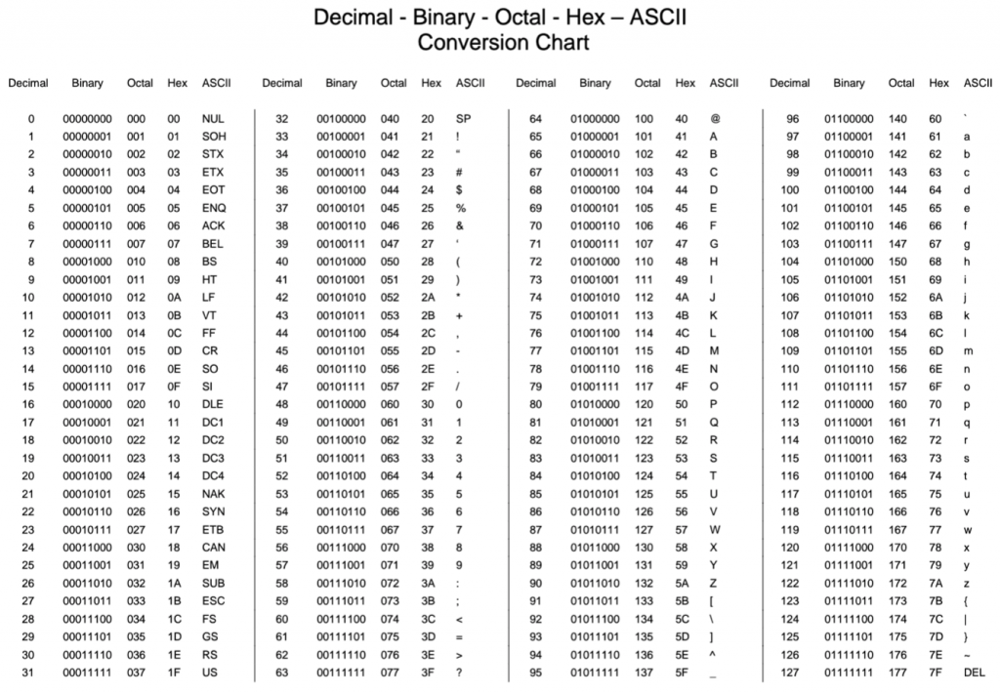
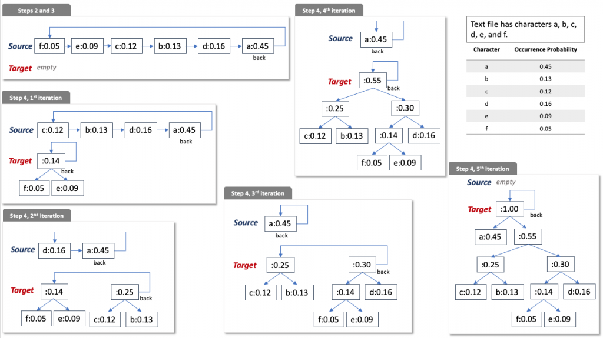
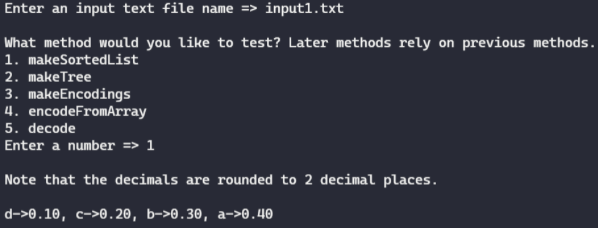
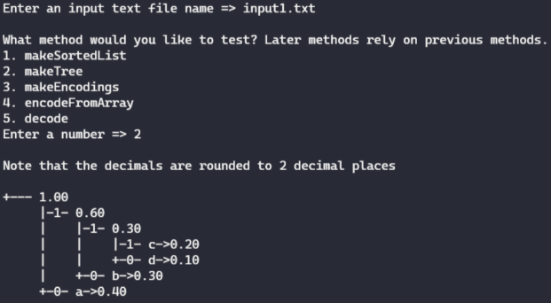
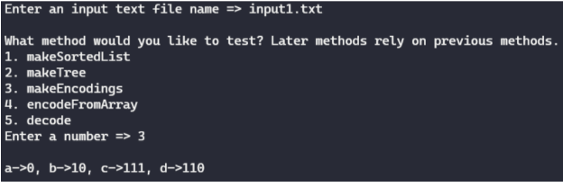
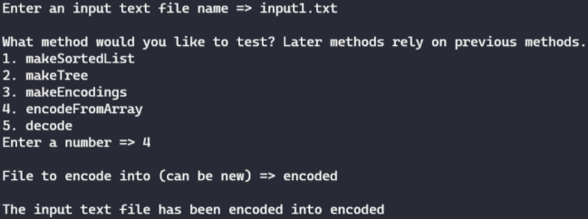
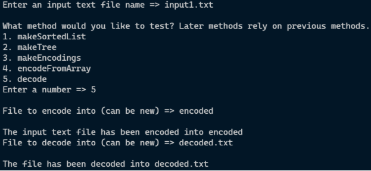

# Programming Assignment - Huffman Coding

The purpose of this assignment is to practice your understanding of the tree data structure.

**Start your assignment early!** You need time to understand the assignment and to answer the many questions that will arise as you read the description and the code provided.

Refer to our [Programming Assignments FAQ](https://ds.cs.rutgers.edu/assignment-faq/) for instructions on how to install VSCode, how to use the command line and how to submit your assignments.

## Overview

The goal of this assignment is to implement a form of **data compression**. That is, given some data, we want to express the same information using less space. For this project, we will specifically focus on compressing text files, so we must first understand how computers represent text internally.

Recall that computers store data as a sequence of bytes. A byte consists of eight bits, and it represents a value between 0 and 255 inclusive. To represent English text, we need a way of assigning each English letter, punctuation symbol, special character, etc. to a sequence of eight bits (a value from 0 to 255). This mapping is provided by the **ASCII encoding**, which is shown in the table below. Notice that ASCII only uses 128 out of the 256 possible values that a byte can store.



For instance, consider the text

```
A b ????
```

Using the table above, we can see that this is represented as the following sequence of bytes

```
65 32 98 32 63 63 63 63
```

Note that the space counts as a character, and its value in the ASCII encoding is `32`.

If we write out the binary string for each character according to the table above and concatenate them together, we get

```
0100000100100000011000100010000000111111001111110011111100111111
```

Storing our original string with the ASCII encoding requires `8 * 8 = 64` bits. There are 8 characters in the text `A b ????` and each character is represented by a byte that is 8 bits long.

Now, imagine if we weren’t forced to use eight bits for every character, and we could instead use the binary encoding

```
? = 0, [space] = 10, A = 110, b = 111
```

Then our string `A b ????` would become

```
11010111100000
```

This is only 14 bits, significantly smaller than the 64 bits that ASCII requires. Also notice that none of these codes are a prefix of any others, so there is no ambiguity when decoding. Here, we compressed our string by finding a different encoding for the characters that minimized the number of bits we needed to use. This is the essence of the **Huffman coding** algorithm, which is described in detail in the next section.

Intuitively, not only do we want to avoid wasting space encoding characters that don’t appear very often, but we want to make sure that the characters which appear the most often receive the shortest codes. As you will see, **Huffman coding** is a way to do just that.

## Huffman Coding

[David Huffman](https://www.computer.org/profiles/david-huffman) invented an algorithm that constructs the code called the Huffman code. [Click here](https://youtu.be/mmKi13MLVq0) for an intuition video.

Algorithm to build the Huffman Tree.

> Use this algorithm in your code. [Click here](https://youtu.be/qAi31QOS2Tk) for a video explaining how to build a tree, encode and decode.

1. Start two empty queues: `Source` and `Target`.
2. Create a node for each character present in the input file, each node contains the character and its occurrence probability.
3. Enqueue the nodes in the `Source` queue in increasing order of occurrence probability.
4. Repeat until the `Source` queue is empty and the `Target` queue has only one node.
    1. Dequeue from either queue or both the two nodes with the smallest occurrence probability. If the front node of `Source` and `Target` have the same occurrence probability, dequeue from `Source` first.
    2. Create a _new node_ whose character is `null` and occurrence probability is the sum of the occurrence probabilities of the two dequeued nodes. Add the two dequeued nodes as children: the first dequeued node as the left child and the second dequeued node as the right child.
    3. Enqueue the _new node_ into `Target`.

### Clarification notes

> Step 4.1 – do the following procedure twice: compare the probability occurrences of the front nodes of `Source` and `Target`. If they are equal or if `Source` is less, dequeue `Source`. If the `Target` is less, dequeue `Target`.
>
> Step 4.2 – the first dequeued node and second dequeued node should be left and right children respectively.



## Implementation

### Overview of Files

-   `CharFreq` class, which houses a `Character` object `character` representing a certain ASCII character, and a `double probOcc` representing its probability of occurrence (value between `0` and `1` showing its frequency). These objects are implemented to compare primarily by `probOcc`, then by character if those are equal. Note that `character` can be `null`. Do not edit this class.
-   `Queue` class, which functions as a simple generic queue. It implements `isEmpty()`, `size()`, `enqueue()`, `dequeue()`, and `peek()`. Do not edit this class.
-   `TreeNode` class, which houses a `CharFreq` object `data` representing a certain character and its frequency, and `TreeNode`s `left` and `right` representing the left and right subtrees of the binary tree. Do not edit this class.
-   `Driver` class, which you can run to test any of your methods interactively. Feel free to edit this class, as it is provided only to help you test. It is not submitted and it is not used to grade your code.
-   `StdIn` and `StdOut`, which are used by the driver, provided methods, and some of your implemented methods as well. Do not edit these classes.
-   `HuffmanCoding` class, which contains some provided methods in addition to annotated method signatures for all the methods you are expected to fill in. You will write your solutions in this file, and it is the file which will be submitted for grading.
-   Multiple text files which contain input data, and can be read by the driver as test cases. These files, as well as the files used for grading are guaranteed to be ASCII only. Feel free to edit them or even make new ones to help test your code. They are not submitted.

### HuffmanCoding.java

> NOTE: You are allowed (encouraged, even) to make helper methods in your HuffmanCoding.java file to be used in your graded methods. Just make sure that they are created with the `private` keyword. Do not add new imports.

#### Methods provided to you

##### `writeBitString`

-   This method takes in a file name and a string consisting of the characters `'1'` and `'0'`, and writes the string to the file.
-   You **must** use this provided method to write your encoding to your output file, and **must not** try to write your string to a file.
-   Note that it does not actually write the characters `'1'` and `'0'`, and actually writes in bits.
-   The file name given does not need to exist yet, and if it doesn’t the method will create a new file. If the file exists, the method will overwrite it.
-   Do not edit this method.

##### `readBitString`

-   This method takes in a file name containing an encoded message, and returns a string consisting of the characters `'1'` and `'0'`.
-   You **must** use this provided method to recover your encoded string from your input file, and **must not** try to read the encoded file yourself.
-   Note that it reads the file byte by byte and converts the bits back into characters.
-   The given file name must exist, and it must have been written to by `writeBitString` already.
-   Do not edit this method.

#### Implementation Notes

-   YOU MAY only update the methods `makeSortedList()`, `makeTree()`, `makeEncodings()`, `encodeFromArray()` and `decode()`.
-   DO NOT add any instance variables to the `HuffmanCoding` class.
-   DO NOT add any `public` methods to the `HuffmanCoding` class.
-   DO NOT use `System.exit()` in your code.
-   DO NOT remove the package statement from `HuffmanCoding`.java
-   YOU MAY add `private` methods to the `HuffmanCoding` class.

#### Methods to be implemented by you

##### `makeSortedList`

-   Implement this method to read a given text file character by character, and return a sorted `ArrayList` of `CharFreq` objects, sorted by frequency. Characters which do not appear in the input file will not appear in your `ArrayList`.
-   Notice that your provided code begins by setting the file with `StdIn`. You can now use methods like `StdIn.hasNextChar()` and `StdIn.readChar()` which will operate on the file as if it was standard input.
-   Also notice that there are only 128 ASCII values. This means that you can keep track of the number of occurrences of each character in an array of size 128. You can use a char as an array index, and it will automatically convert to the corresponding ASCII `int` value. You can convert an ASCII `int` value `num` back into its corresponding `char` with `(char) num`.
-   The Huffman Coding algorithm does not work when there is only 1 distinct character. For this specific case, you must add a different character with `probOcc` `0` to your `ArrayList`, so you can build a valid tree and encode properly later. For this assignment, simply add the character with ASCII value one more than the distinct character. If you are already at ASCII value 127, wrap around to ASCII `0`. DO NOT add more than one of these, and also DO NOT add any characters with frequency `0` in any normal input case.
-   Because the `CharFreq` object has been implemented to compare based on `probOcc` primarily, you can simply use [`Collections.sort(list)`](<https://docs.oracle.com/en/java/javase/11/docs/api/java.base/java/util/Collections.html#sort(java.util.List)>) before returning your final `ArrayList`. You do not need to implement your own sorting method.

Below is an example of running the driver to help test this method:



##### `makeTree`

-   Implement this method to take in your sorted `ArrayList` of `CharFreq` objects and return the root of a valid Huffman Coding tree.
-   You will be using the `TreeNode` class to represent one node of your Huffman Coding tree. It contains a `CharFreq` object as its data, and references to the left and right.
-   You will be using the provided `Queue` class to code the Huffman Coding process. You must use the Huffman Coding algorithm outlined above.
-   `TreeNode`s which do not have any children represent encodings for characters. These nodes of your Huffman Coding tree must contain both a `character` and a `probOcc` in their `CharFreq` object.
-   `TreeNode`s which have at least one child do not represent encodings for characters. These nodes of your Huffman Coding tree must contain a `null` `character`, and their `probOcc` must be the sum of their children. The root `TreeNode` will have a `probOcc` of `1.0`.

Below is an example of running the driver to help test this method:



##### `makeEncodings`

-   Implement this method to take in the root of your Huffman Coding tree and return a `String` array of size 128 containing a `String` of 1’s and 0’s for every character. Characters not present in the Huffman Coding tree will have their spots in the array left `null`.
-   Remember that going to the left child of your Huffman Coding tree represents adding a `'0'` to your encoding for a character, and going to the right child represents adding a `'1'`. The encoding for a character is simply given by the path to get to that node from the root.
-   Remember that only `TreeNode`s with no children contain a character, and only the paths to these `TreeNode`s will receive an encoding.
-   You can convert a `Character` object to its `int` ASCII code by casting it with `(int)`.

Below is an example of running the driver to help test this method:



##### `encodeFromArray`

-   Implement this method to take in your array of `String` encodings, an input file containing some text we want to encode, and an output file we want to encode into. It will write the compressed encoding of the input file into the output file.
-   Notice that your provided code begins by setting the file with `StdIn`. You can now use methods like `StdIn.hasNextChar()` and `StdIn.readChar()` which will operate on the file as if it was standard input.
-   You are to create a `String` of ones and zeros which represents your encoding of the input text file using your encodings array. The last line of this method must use the `writeBitString` method to write this `String` to the file in bits. DO NOT try to write to the file manually.
-   If the file was successfully compressed, your output file will have a significantly smaller file size than the original text file. Feel free to open your file explorer and check!

Below is an example of running the driver to help test this method:



> Check out the encoded file in your file explorer. It will be significantly _smaller_ than the original!

##### `decode`

-   Implement this method to take in your encoded file and the root of your Huffman Coding tree, write the decoded version to a new file. If done correctly, the decoding will be the same as the contents of the text file used for encoding.
-   Notice that your provided code begins by setting the output file with `StdOut`. You can now use methods like `StdOut.println()` and `StdOut.print()` which will operate on the decodings file as if it was standard output.
-   You must start your method using the provided `readBitString` method in order to get the string of ones and zeros from the encoded file. DO NOT try to read the encoded file manually.
-   You must then use your tree and the procedure outlined above to decode the bit string into characters, according to the tree’s encoding scheme.

Below is an example of running the driver to help test this method:



> The decoded output will be an exact copy of your input file.

## VSCode

### Executing and Debugging

-   You can run your program through VSCode or you can use the Terminal to compile and execute. We suggest running through VSCode because it will give you the option to debug.
-   [How to debug your code](https://code.visualstudio.com/docs/java/java-debugging)
-   If you choose the Terminal:

    -   To compile: from Huffman directory/folder:

        ```
        javac -d bin src/huffman/*.java
        ```

    -   To execute:
        ```
        java -cp bin huffman.Driver
        ```

## Before submission

-   Collaboration policy. Read our [collaboration policy here](https://ds.cs.rutgers.edu/#academic-integrity).
-   Submitting the assignment. Submit `HuffmanCoding.java` separately via the web submission system called Autolab. To do this, click the `Assignments` link from the course website; click the `Submit` link for that assignment.

## Getting help

If anything is unclear, don’t hesitate to drop by office hours or post a question on Piazza. Find instructors office hours by clicking the [Staff](https://ds.cs.rutgers.edu/staff/) link from the course website. In addition to office hours we have the [CAVE](https://resources.cs.rutgers.edu/docs/rooms-equipment/cave/) (Collaborative Academic Versatile Environment), a community space staffed with lab assistants which are undergraduate students further along the CS major to answer questions.

## Credits

Problem by Ishaan Ivaturi
