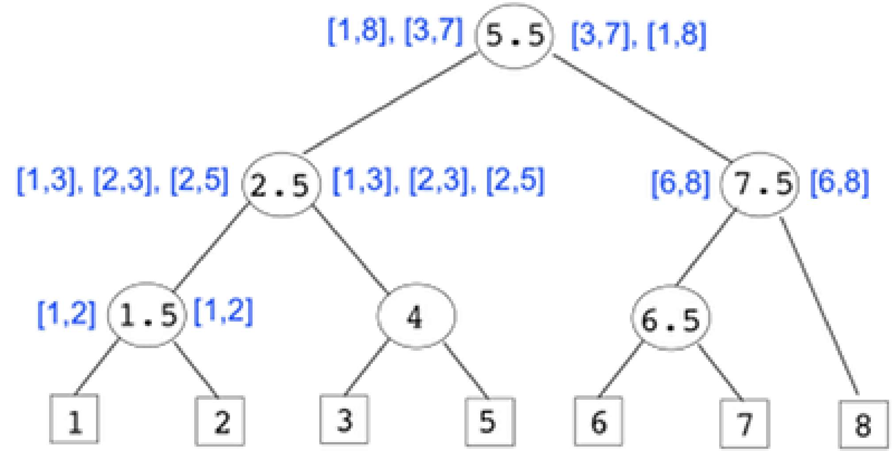
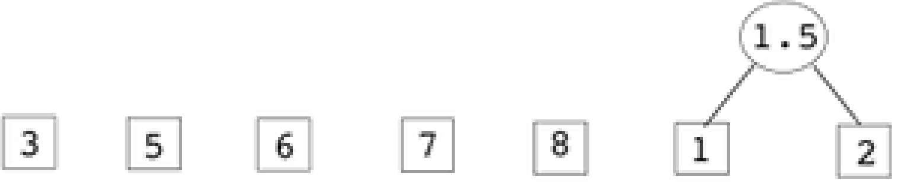
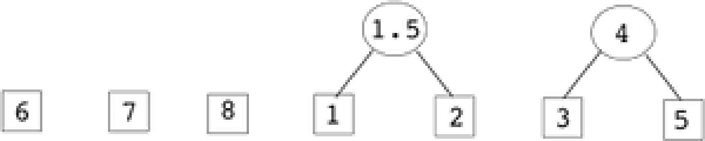
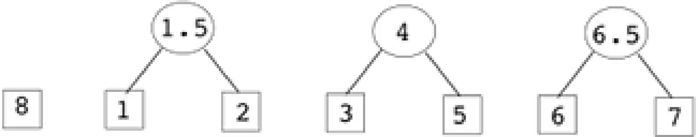
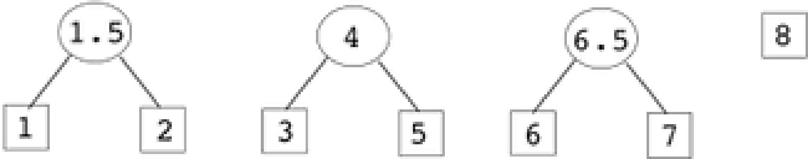

# Programming Assignment - Interval Tree

In this assignment, you will implement a data structure called the Interval Tree that is specially designed to efficiently find intersections of line segments.

## Rules

-   You will work on this assignment individually. Read the [DCS Academic Integrity Policy for Programming Assignments](http://www.cs.rutgers.edu/academics/undergraduate/academic-integrity-policy/programming-assignments) - you are responsible for abiding by the policy. In particular, note that "**All Violations of the Academic Integrity Policy will be reported by the instructor to the appropriate Dean**".

-   **IMPORTANT - READ THE FOLLOWING CAREFULLY!!!**

    Assignments emailed to the instructor or TAs will be ignored--they will NOT be accepted for grading.

    We will only grade submissions in Sakai.
    If your program does not compile, you will not get any credit.

    Most compilation errors occur for two reasons:

    1. You are programming outside Eclipse, and you delete the `package` statement at the top of the file. If you do this, you are changing the program structure, and it will not compile when we test it.
    2. You make some last minute changes, and submit without compiling.

    **To avoid these issues, (a) START EARLY, and give yourself plenty of time to work through the assignment, and (b) Submit a version well before the deadline so there is at least something in Autolab to grade.**

## Intervals

Intervals are extents of time or one-dimensional space. They form the basis of many applications such as appointment calendars, geographic
information systems, and graphics programs.

For the purpose of this assignment, we will restrict intervals to have integer end-points greater than zero. Also, an interval _cannot_ degenerate to a point (both end points being the same).

```
                |-----|-----|-----|
                  Interval (2, 5)

<---|-----|-----|-----|-----|-----|--->
    0     1     2     3     4     5
```

The beginning of the interval is its left endpoint and the end of the interval is its right endpoint. Two intervals intersect if they both occupy some common part of the line, i.e., they overlap. The intervals `(2, 5)` and `(4, 9)` intersect, as do the intervals `(2, 5)` and `(5, 9)` [a common end point is treated as an intersection], but `(2, 5)` and `(6, 9)` do not intersect.

## Intersection Queries

Applications in which intervals are used need to do a lot of intersection queries. Suppose we are given a set, `S`, consisting of `n` intervals. This set might contain duplicates, and the intervals in it might intersect each other. With such a set `S`, we will often be given another query interval and asked, "which members of `S` does the query interval intersect?" How quickly can we answer this query? How much memory will we need to do it?

What if we stored `S` in a linear data structure such as an array or a linked list. If `I_q` is a query interval, we can use the following algorithm to report the intervals in `S` that intersect with `I_q`

```
for each interval I in the set S
    if I intersects I_q
        report I
    endif
endfor
```

Since we don't need to store any information other than `S` itself, this approach uses the minimum amount of memory possible. However, it requires `O(n)` computation time - linearly proportional to the number of intervals in `S`. This is usually too slow for practical purposes since the number of intervals in `S` would be typically much greater than the number of intersecting intervals reported for a query. We need to store the intervals in a more efficient data structure so that intersection queries can be answered quickly. The **interval tree** is such a structure, tailored to answer intersection queries quickly. You can think of an interval tree as a highly specialized binary search tree.

## Interval Tree

An interval tree uses relatively little memory (`O(n)` space) while allowing us to answer queries in `O(k + log(N))` time, where `k` is the number of intervals in `S` that intersect the query interval, and `N` is the number of distinct endpoints in `S`. Since the time it takes to answer a query depends (at least partially) on how many intervals are actually reported, we say that we are using an **output-sensitive** query algorithm. In practice, `O(k + log(N))` will almost always be much less than `O(n)` (number of intervals), so this approach is usually very fast.

The data structure you will implement for this assignment has been simplified somewhat. Under certain circumstances it will perform somewhat worse than the optimal time of `O(k + log(N))`.

Here is the complete interval tree built to store the intervals

```
[1,2], [1,3], [1,8], [2,3], [2,5], [3,7], [6,8]
```



The interval tree is a special type of binary search tree, where each node contains a number, called the split value. Also, each node, except for the leaf nodes (square nodes), stores two lists of intervals, each interval containing the split value. Both lists contain the same intervals, but one list is sorted by the left endpoints, and the other by the right endpoints.

The leaf nodes are built out of the left and right endpoints of the intervals, arranged in sorted order, without duplicates. That is, if an endpoint occurs in more than one interval, only one copy of the endpoint is used. In the example, the unique endpoints are

```
1, 2, 3, 5, 6, 7, 8
```

Each of these will result in a leaf node. For each leaf node, the split value is the endpoint itself. Remember, the leaf nodes do not have any intervals.

For every internal (i.e. non-leaf) node, its split value is the midpoint of the largest endpoint value in its left subtree and the smallest endpoint value in its right subtree. These values will be found at the appropriate leaf nodes in the respective subtrees. (Note: The split value of a node is NOT the midpoint of the split values of its children.)

For instance, in the sample tree above, the split value of the right child of the root is `7.5`, because the largest endpoint value in its left subtree is `7`, and the smallest endpoint value in its right subtree is `8`, and their midpoint is `7.5`. Similarly, the split value of the left child of the root is `2.5`, because the largest endpoint value in its left subtree is `2`, and the smallest endpoint value in its right subtree is `3`, and their midpoint is `2.5`.

**Every interval from `S` appears in only one node of the tree**, and this node is the "highest" node (closest to the root) in the tree whose split value falls within the interval. In other words, each interval from `S` is placed in the tree as high as it can legally go, given the rule that it must be placed in a node whose split value is contained in the interval.

## Algorithm to build an Interval Tree

The following algorithm may be used to build an interval tree, illustrated for the sample set of intervals above:

```
[1,2], [1,3], [1,8], [2,3], [2,5], [3, 7], [6,8]
```

`algorithm build_tree`

-   Input: A set of intervals, `S`
-   Output: Interval tree

1. Sort the list of intervals according to left endpoints, let this list be `Lsort`.

    ```
    Lsort = [ [1,8] , [1,2] , [1,3] , [2,5] , [2,3] , [3,7] , [6,8] ]
    ```

    > Intervals with the same left endpoint can appear in any sequence.

2. Sort the list of intervals according to right endpoints, let this list be `Rsort`.

    ```
    Rsort = [ [1,2] , [1,3] , [2,3] , [2,5] , [3,7] , [1,8] , [6,8] ]
    ```

    > Intervals with the same right endpoint can appear in any sequence.

3. Get all distinct (no duplicates) left endpoints from `Lsort` - let this be `Points`.

    ```
    Points = [ 1 , 2 , 3 , 6 ]
    ```

    > Note that the endpoints in `Points` are in sorted order.

4. Add to `Points` all distinct (no duplicates) right endpoints from `Rsort`, which are not already in `Points`.

    ```
    Points = [ 1 , 2 , 3 , 5 , 6 , 7 , 8 ]
    ```

    > The order has to be maintained while adding, so when `5` is added from `Rsort`, it has to be inserted before the existing `6`.

5. Pseudocode:

    ```
    for each point p in Points do
        create a tree T with a single node containing p
        set split value of this node to p
        enqueue T in queue Q
    endfor
    ```

    

6. Pseudocode:

    ```
    Lets be the size of Q
    if s == 1 then
        T = dequeue Q
        T is the root of the interval tree
        go to step 7
    endif

    temps <- s
    while temps > 1 do
        T1 = dequeue Q
        T2 = dequeue Q
        Let v1 be the MAXIMUM split value of leaf nodes in T1
        Let v2 be the MINIMUM split value of leaf nodes in T2
        Create a new node N containing split value x, where x = (v1 + v2) / 2
        Create a new tree T with N as root, T1 as left child of N, and T2 as right child of N
        enqueue N into Q
        temps = temps - 2
    endwhile
    if temps == 1 do
        dequeue from Q and enqueue back into Q
    endif

    Repeat Step 6
    ```

    > Note that's the number of small trees that still need to be combined into larger trees during the next pass, and subsequent passes.

    Following is the trace of Step 6 on our example:

    > At the start of the first iteration of Step 6, `s = 7` (all leaf nodes), and the following is the entire first iteration, which includes all the iterations of the `while` loop (each figure shows the result an iteration):

    - First iteration of `while` loop, `temps = 7`:

        

    - Second iteration of `while` loop, `temps = 5`:

        

    - Third iteration of `while` loop, `temps = 3`:

        

    - Fourth and final iteration of `while` loop, `temps = 1`:

        

    So, at the end of the first iteration of Step 6, the queue will contain the trees with root split values

    ```
    1.5, 4, 6.5, 8
    ```

    The second iteration of Step 6 will start with `s = 4` since there are now 4 items in the queue. At the end of the second iteration, the queue will contain the trees with root split values `2.5, 7.5`.

    At the end of the third iteration, the queue will contain a single tree with root split value `5.5`.

    At this point, step 6 is started again, but the `if` condition at the top of the iteration is `true`, we go to step 7.

7. In this step, we map the intervals to the tree.

    ```
    Let the interval tree constructed in Step 6 be T
    for each interval [x,y] in Lsort do
        starting at the root,
            search in the interval tree for the first (highest) node, N, whose split value is contained in [x,y]
        add [x,y] to the LEFT LIST of node N
    endfor
    for each interval [x,y] in Rsort do
        starting at the root,
            search in the interval tree for the first (highest) node, N, whose split value is contained in [x,y]
        add [x,y] to the RIGHT LIST of node N
    endfor
    ```

8. Return `T`.

`end algorithm build_tree`

## Algorithm to query an Interval Tree

The following algorithm may be used to query an existing interval tree.

Following the algorithm is an illustration of its execution.

`algorithm query_tree`

-   Input: Interval tree T, query interval I_q
-   Output: ResultList, a list of intervals from T that intersect I_q

Definitions:

-   Let `ResultList` be empty.
-   Let `R` be the root node of `T`.
-   Let `SplitVal` be the split value stored in `R`.
-   Let `Llist` be the list of intervals stored in `R` that is sorted by left endpoint.
-   Let `Rlist` be the list of intervals stored in `R` that is sorted by right endpoint.
-   Let `Lsub` be the left subtree of `R`.
-   Let `Rsub` be the right subtree of `R`.

1. If `R` is a leaf, return empty list.
2. Pseudocode:

    ```
    If SplitVal falls within I_q then
        Add all intervals in Llist to ResultList
        Query Rsub and add the results to ResultList
        Query Lsub and add the results to ResultList
    else if SplitVal falls to the left of I_q then
        Let i be the size of Rlist
        while (i >= 0 and the i-th interval in Rlist intersects I_q)
            Add the i-th interval to ResultList
            i = i - 1
        endwhile
        Query Rsub and add the results to ResultList
    else if SplitVal falls to the right of I_q then
        Let i be 0
        while (i < the size of Llist and the i-th interval in Llist intersects I_q)
            Add the ith interval to ResultList
            i = i + 1
        endwhile
        Query Lsub and add the results to ResultList
    endif
    ```

3. Return `ResultList`.

`end algorithm query_tree`

## Illustration of Querying on an Interval Tree

Using the sample tree built earlier, we will trace a query interval `[4, 6] (I_q)`

```
1. R = root node, SplitVal = 5.5, ResultList = {}
    I_q contains SplitVaL -> ResultList ={ [1, 8], [3, 7] }

    Recurse on left subtree ->
    2. R = left child of root, SplitVaL = 2.5, ResultList = {}
    I_q lies to right of SplitVaL -> ResultList = { [2, 5] }

    Recurse on right subtree only ->
        3. R = right child of left child of root, SplitVal = 4.0, ResultList = {}
        I_q contains SplitVal -> ResultList = {}

        Recurse on left subtree ->
            4. R = leaf
            return {}

        Add results -> ResultList = {}

        Recurse on right subtree ->
            5. R = leaf
            return {}

        Add results -> ResultList = {}
        return {}

    Add results -> ResultList = { [2, 5] }
    return { [2, 5] }

Add results -> ResultList = { [1, 8], [3, 7], [2, 5] }

Recurse on right subtree ->
    6. R = right child of root, SplitVal = 7.5, ResultList = {}
    I_q lies to left of SplitVal -> ResultList = { [6, 8] }

    Recurse on left subtree only ->
        7.  R = left child of right child of root, SplitVal = 6.5, ResultList = {}
            I_q lies to left of SplitVaL -> ResultList = {}

        Recurse on left subtree only ->
            8. R = leaf
            return {}

        Add results -> Resultlist = {}
        return {}

    Add results -> Resultlist = { [6, 8] }
    return { [6, 8] }

Add results -> Resultlist = { [1, 8], [3, 7], [2, 5], [6, 8] }
return { [1, 8], [3, 7], [2,5], [6, 8] }
```

## Test your understanding

Given the following intervals:

```
[1,2], [2,3], [3,4], [1,4], [2,5], [3,8], [4, 7]
```

1. Build an Interval Tree based on the interval tree building algorithm described above. Show the status of the queue _after every iteration_ of the loop (we have shown the status of the queue after only _one_ iteration of the loop). Draw the final Interval Tree.
2. Once the Interval Tree is built, trace the query on the interval `[2,6]`. Again, show the steps as described above, or pictorially.

## Implementation

You will see a project called Interval Tree with the following classes in `package structures`:

-   `Interval`
-   `IntervalTree`
-   `IntervalTreeNode`
-   `Queue`

There is another `package`, `apps` which has a single class, `IntervalTreeDriver`.

The project also comes with a sample input file, `intervals.txt`, placed directly underneath the project folder.

Be sure to carefully read the documentation for the fields and methods in `IntervalTreeNode.java` and `Interval.java`, and the documentation for the methods of `IntervalTree.java`.

Fill in the following methods where indicated in `IntervalTree.java`.

|           Method            | Points |
| :-------------------------: | :----: |
|       `sortIntervals`       |   10   |
|    `getSortedEndPoints`     |   15   |
|      `buildTreeNodes`       |   20   |
|    `mapIntervalsToTree`     |   15   |
| `findIntersectingIntervals` |   15   |

The ONLY changes you are allowed to make in `IntervalTree.java` are the following:

-   Fill in the implementations of the required methods.
-   Add `private` helper methods as needed.

Note:

-   In the `build_tree` algorithm, step 5, where it says create a tree `T` with a single node containing `p`, the tree refers to an `IntervalTreeNode` object. All entries in the queue are `IntervalTreeNode` objects. In the `IntervalTree` class given to you, note that the `buildTreeNodes` method returns an `IntervalTreeNode` object, which is the root of the interval tree you build. (The constructor then assigns this returned value to the `root` field of the `IntervalTree` object.)
-   For leaf nodes in the tree, the max and min split values are the same as the split value.
-   The order of intervals returned by `findIntersectingIntervals` does not matter, as long as your code follows the algorithm to make sure nodes that are guaranteed to not have any matches are NOT examined.

## Running the Program

Run driver `apps.IntervalTreeDriver`. It takes an input data file containing a list of intervals. Each line of the input file describes one interval, and has three parts:

1. Left endpoint.
2. Right endpoint.
3. Data (in the form of a string) to be associated with the interval. This can be used to distinguish between two or more intervals with identical endpoints.

Here's the sample input file, `intervals.txt`, that's bundled with the project:

```
1 2 intrvl-1-2
2 5 intrvl-2-5
6 8 intrvl-6-8
2 3 intrvl-2-3
1 8 intrvl-1-8
3 7 intrvl-3-7
1 3 intrvl-1-3
```

Each line is an interval. The first two values are the left and right interval end points (integers only!), and the last value is a string description of the interval. Here's a sample run using this input file:

```
Enter intervals file name => intervals.txt
Read the following intervals:
[1,2]: intrvl-1-2
[2,5]: intrvl-2-5
[6,8]: intrvl-6-8
[2,3]: intrvl-2-3
[1,8]: intrvl-1-8
[3,7]: intrvl-3-7
[1,3]: intrvl-1-3

Enter an interval (e.g. 3 5) to intersect, quit to stop => 3 5
[1,8]: intrvl-1-8
[3,7]: intrvl-3-7
[2,5]: intrvl-2-5
[2,3]: intrvl-2-3
[1,3]: intrvl-1-3

Enter an interval (e.g. 3 5) to intersect, quit to stop => 6 8
[1,8]: intrvl-1-8
[3,7]: intrvl-3-7
[6,8]: intrvl-6-8

Enter an interval (e.g. 3 5) to intersect, quit to stop=> 5 6
[1,8]: intrvl-1-8
[3,7]: intrvl-3-7
[2,5]: intrvl-2-5
[6,8]: intrvl-6-8

Enter an interval (e.g. 3 5) to intersect, quit to stop => 9 10

Enter an interval (e.g. 3 5) to intersect, quit to stop => quit
```

You should create an input file for each set of intervals used in your test cases, with the same format as `intervals.txt`.

## Submission

Submit your `IntervalTree.java` file ONLY.

## Frequently Asked Questions

-   **Q**: Can we use `Collections`/`Comparator` to sort?

    > **A**: NO. You may NOT use any external classes. You need to implement sorting from scratch, using whatever algorithm you have learned in 111 you may NOT use pre-defined sorting methods in the Java libraries. Credit is being given for this method for _your_ implementation of sorting, not for using an existing one. Efficiency does not matter, grading will be on correctness of result only.

-   **Q**: Can the `leftIntervals` and `rightIntervals` array lists in `IntervalTreeNode` be empty instead of `null`, if there are no intervals mapped to that node?

    > **A**: NO, `leftIntervals` and `rightIntervals` are initialized to `null` for every node, and should remain `null` if there are no intervals mapped.

-   **Q**: Will we get bad intervals in the input, like `[5,3]` or `[2,2]`?

    > **A**: NO. All input intervals, both in the input file, and for the intersection query, will be legit, i,e, the first end point will be strictly less than the second end point.

-   **Q**: Will there be empty input files?

    > **A**: No. Every input file will have at least one interval in it.

-   **Q**: Could there be duplicate intervals?

    > **A**: YES. Two (or more) intervals may have the same end points, but their descriptions will differ.
