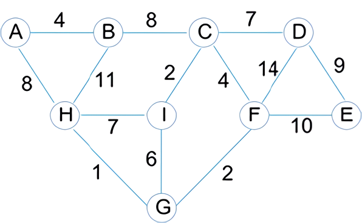
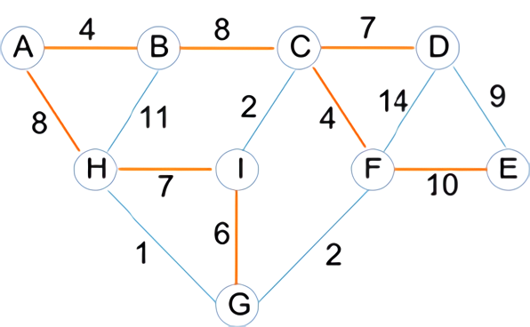
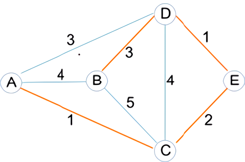

# Programming Assignment - Minimum Spanning Tree (MST)

In this assignment, you will implement Tarjan and Cheriton's round‐robin algorithm for finding the minimum spanning tree of a weighted undirected graph.

**Note: This assignment challenges you to (a) understand a non‐trivial algorithm, and (b) match the algorithm to code. It may take a couple of readings of the entire algorithm description and the given code template before you see how all the pieces connect. Draw pictures of data structures for better understanding!!**

## Rules

-  You will work on this assignment individually. Read DCS Academic Integrity Policy for Programming Assignments ‐ you are responsible for abiding by the policy. In particular, note that "All Violations of the Academic Integrity Policy will be reported by the instructor to the appropriate Dean".

-  **IMPORTANT - READ THE FOLLOWING CAREFULLY!!!**

   Assignments emailed to the instructor or TAs will be ignored--they will NOT be accepted for grading.

   We will only grade submissions in Sakai. If your program does not compile, you will not get any credit.

   Most compilation errors occur for two reasons:

   1. You are programming outside Eclipse, and you delete the "package" statement at the top of the file. If you do this, you are changing the program structure, and it will not compile when we test it.
   2. You make some last minute changes, and submit without compiling.

   To avoid these issues, (a) START EARLY, and give yourself plenty of time to work through the assignment, and (b) Submit a version well before the deadline so there is at least something in Autolab to grade.

## Minimum Spanning Tree

Several real‐world problems need to find a so‐called minimum spanning tree (MST) in an undirected graph with positive edge weights.

In an undirected graph, any subset of the vertices and edges that does not contain any cycles is a tree. A spanning tree is a tree that connects every vertex of the graph. If the graph has weighted edges, a minimum spanning tree is one for which the sum of the weights of the tree edges is minimized, i.e. the edge weights sum is no more than that for any other spanning tree. (Multiple minimum spanning trees are possible for a graph.)

The following is an example of weighted undirected graph, stored in file [graph1.txt](graph1.txt).



Here are a couple of spanning trees that can be computed on this graph:



> The sum of the edge weights for this spanning tree is 54.


> The sum of the edge weights for this spanning tree is 37.

## Round‐robin MST Algorithm

A partial spanning tree is a tree that spans only a subset of a graph (only some of the vertices in the graph are connected by the partial tree). In Tarjan and Cheriton's round‐robin algorithm, partial trees are built and combined until only one remains: the MST of the entire graph.

Following is the algorithm, which is illustrated using this graph, stored in file [graph2.txt](graph2.txt).


There are 9 steps in the following algorithm, followed by some notes. Read the whole thing (all steps plus notes) carefully and repeatedly until you get it (draw pictures as needed!). After getting a reasonably good understanding of the algorithm, read over the code template you are given so you can map the algorithm to the implementation, and fill in any blanks in your understanding.

1. Create an empty list `L` of partial trees.
2. Separately for each vertex `v` in the graph:

   1. Create a partial tree `T` containing only `v`.
   2. Mark `v` as belonging to `T` (this will be implemented in a particular way in the code).
   3. Create a priority queue (heap) `P` and associate it with `T`.
   4. Insert all of the arcs (edges) connected to `v` into `P`. The lower the weight on an arc, the higher its priority.
   5. Add the partial tree `T` to the list `L`.

   We will represent a partial tree like this:

   ```
   Vertices: [list of vertices, root first] PQ: [arcs in priority order]
   ```

   At the end of step 2, we have the following list, `L`, of partial trees:

   ```
   T1. Vertices: A PQ: (A C 1), (A D 3), (A B 4)
   T2. Vertices: B PQ: (B D 3), (B A 4), (B C 5)
   T3. Vertices: C PQ: (C A 1), (C E 2), (C D 4), (C B 5)
   T4. Vertices: D PQ: (D E 1), (D A 3), (D B 3), (D C 4)
   T5. Vertices: E PQ: (E D 1), (E C 2)
   ```

   Note:

   -  Every partial tree has one vertex designated as its "root".
   -  The PQ representation above lists arcs in a sorted order of arc weights (priorities), ONLY to show that that if the arcs were to be removed one at a time, they would follow the listed order. The actual ordering of arcs in the heap will be different since the heap implements only a partial order on its items.
   -  The initial ordering of partial trees in list `L` is arbitrary.

3. Remove the first partial tree `PTX` from `L`. Let `PQX` be `PTX`'s priority queue.

   ```
   T1. Vertices: A P1: (A C 1), (A D 3), (A B 4)
   ```

4. Remove the highest‐priority arc from `PQX`. Say this arc is `α`. Let v1 and `v2` be the two vertices connected by α, where v1 belongs to `PTX`.

   ```
   α: (A C 1) v1: A v2: C
   ```

5. If `v2` also belongs to `PTX`, go back to Step 4 and pick the next highest priority arc, otherwise continue to the next step.

   > `C` belongs to a different partial tree (`T3`) than `A`, continue to the next step.

6. Report `α` ‐ this is a component of the minimum spanning tree.

   > `(A C 1)` is a component of the MST

7. Find the partial tree `PTY` to which `v2` belongs. Remove `PTY` from the partial tree list `L`. Let `PQY` be `PTY`'s priority queue.

   ```
   T3. Vertices: C PQ: (C A 1), (C E 2), (C D 4), (C B 5)
   ```

8. Combine `PTX` and `PTY`. This includes merging the priority queues `PQX` and `PQY` into a single priority queue. Append the resulting tree to the end of `L`.

   ```
   T2. Vertices: B PQ: (B D 3), (B A 4), (B C 5)
   T4. Vertices: D PQ: (D E 1), (D A 3), (D B 3), (D C 4)
   T5. Vertices: E PQ: (E D 1), (E C 2)
   T13. Vertices: A C PQ: (C A 1), (C E 2), (A D 3), (A B 4), (C D 4), (C B 5)
   ```

9. If there is more than one tree in `L`, go to Step 3.

### Notes

-  Arc `(x y)` is the same as arc `(y x)`.
-  A partial tree is labeled (identified) by its "root" vertex. This vertex is not really special ‐ it is simply the first vertex that was added to the tree. We can use this label to tell whether or not two given vertices belong to the same tree.
-  Each vertex keeps a pointer to its "parent" in the partial tree. The parent is just some other vertex in the tree ‐ there isn't necessarily an edge connecting a vertex to its parent. From a given vertex, we can follow the chain of parent pointers all the way up to the root (vertex) of the partial tree to which the vertex belongs. If two vertices have the same root they are in the same tree, and if they have different roots they are in different trees.
-  When merging one partial tree (say `PTY`) into another (say `PTX`), we have to change the root of all of `PTY`'s vertices to the root of `PTX`. We can do this easily by setting the parent pointer of the root of `PTY` to point to the root of `PTX`: any vertex which used to be in `PTY` will now have `PTX`'s root as its root.

Continuing to trace the algorithm on the example, after the first iteration there are still four partial trees in the list. So we repeat the process from Step 3 on. The next partial tree to be removed is `T2`, and its highest priority arc is `(B D 3)`. Since `D` is in a different partial tree (`T4`) than `T2`, the partial trees `T2` and `T4` are combined, and the list is updated to the following:

```
T5. Vertices: E PQ: (E D 1), (E C 2)
T13. Vertices: A C PQ: (C A 1), (C E 2), (A D 3), (A B 4), (C D 4), (C B 5)
T24. Vertices: B D PQ: (D E 1), (D A 3), (D B 3), (B A 4), (D C 4), (B C 5)
```

Repeating again, the next partial tree to be removed is `T5`, and its highest priority arc is `(E D 1)`. Since `D` is in a different partial tree (`T24`) than `T5`, the partial trees `T5` and `T24` are combined, and the list is updated to the following:

```
T13. Vertices: A C PQ: (C A 1), (C E 2), (A D 3), (A B 4), (C D 4), (C B 5)
T524. Vertices: E B D PQ: (D E 1), (E C 2), (D A 3), (D B 3), (B A 4), (D C 4), (B C 5)
```

Repeating again, the next partial tree to be removed is `T13`, and its highest priority arc is `(C A 1)`. However, `C` and `A` belong to the same partial tree, we discard this arc (Step 5) and return to Step 4, to pick the next highest priority arc. This is `(C E 2)`. Since `E` is in a different partial tree (`T524`) than `T13`, the partial trees `T13` and `T524` are combined, and the list is updated to the following:

```
T13524. Vertices: A C E B D PQ: (D E 1), (E C 2), (A D 3), (D A 3), (D B 3), (A B 4), (C D 4), (B A 4), (D C 4), (C B 5), (B C 5)
```

Notice that when combining the priority queues, several arcs appear in duplicate (e.g. `(A D 3)` and `(D A 3)`, etc.) in the combined priority queue, even though they are the same arc. This is ok, it will not effect the correctness of the algorithm. (In other words, there is no need to check whether the priority queues to be combined have common arcs.)

Now that there is only one tree left, we are done. The set of arcs we used to combine the partial trees is the MST of the graph:



```
A C 1
B D 3
E D 1
C E 2
```

> Note: The sequence in which arcs are added to the MST is irrelevant.

## Implementation

You will see a project called `MST` with the following classes:

-  `structures.Vertex` (with inner class `Neighbor`)
-  `structures.Graph`
-  `structures.MinHeap`
-  `apps.PartialTree` (with inner class `Arc`)
-  `apps.PartialTreeList`
-  `apps.MST`

The project also includes the [graph1.txt](graph1.txt) and [graph2.txt](graph2.txt) files used in the description of the algorithm in the [Minimum Spanning Tree](#minimum-spanning-tree) section.

Fill in the following methods where indicated in the [PartialTreeList.java](src/apps/PartialTreeList.java) and [MST.java](src/apps/MST.java) files:

|                 Method                  | Points |
| :-------------------------------------: | :----: |
|            `MST: initialize`            |   20   |
|        `PartialTreeList: remove`        |   10   |
| `PartialTreeList: removeTreeContaining` |   25   |
|             `MST: execute`              |   20   |

The ONLY changes **you are allowed** to make in any of the given files are the following:

-  Fill in the implementations of the required methods.
-  Add private helper methods in the `PartialTreeList` and `MST` classes.

## Running the Program

You need to write your own driver program to create a `Graph` object from an input graph file, and call the `MST` methods to run the algorithm on this graph.

For all the test cases you build, create test files like `graph2.txt` and place them in the same folder as `graph2.txt`.

Note: The `PartialTree` class `toString` method returns a string that shows a single (root) vertex and a list of arcs in the priority queue. This is different from the illustration of the algorithm. So, for instance, the illustration had this after the first merge of step 8, for the tree `T13`:

```
Vertices: A C PQ: (C A 1), (C E 2), (A D 3), (A B 4), (C D 4), (C B 5)
```

But the `PartialTree` class `toString` method will show this:

```
Vertices: A PQ: (C A 1) (C E 2) (A D 3) (A B 4) (C B 5) (C D 4)
```

> The `A` vertex is shown because it is the root. The `C` vertex is not shown.

## Submission

Submit your `PartialTreeList.java` and `MST.java` files as two separate files, NOT as a single zip file.
