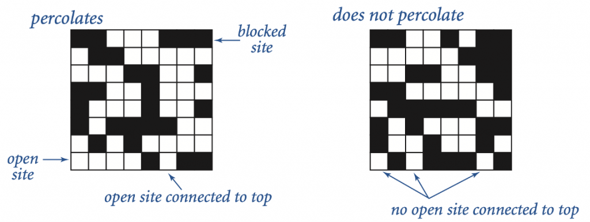
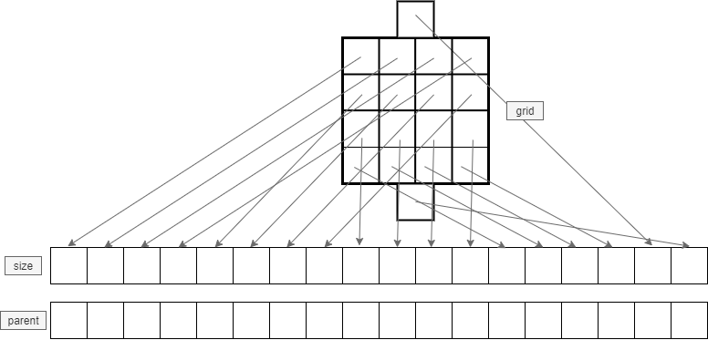

# Programming Assignment - Percolation

The purpose of this assignment is to practice your understanding of the Union-Find data type and the 2D array data structure.

**Start your assignment early!** You need time to understand the assignment and to answer the many questions that will arise as you read the description and the code provided.

Refer to our [Programming Assignments FAQ](https://ds.cs.rutgers.edu/assignment-faq/) for instructions on how to install VSCode, how to use the command line and how to submit your assignments.

## Background

So far, we have learned about an abstract data type called Union Find that organizes data into disjoint sets and allow us to

1. Unify two sets, and
2. Given an element of a set it finds the representative of the set.

With that knowledge, together with some clever tricks, we can test if a `n`-by-`n` grid percolates.

Percolation is an abstract model for many physical systems. Given a `n`-by-`n` grid of sites, each site is open with probability `p`, the system percolates if and only if any open site in the top row in the grid is connected to any open site in the bottom row by open sites.



We model percolation as a dynamic-connectivity problem and use union-find to check if the system percolates.

## How to model Percolation as a dynamic-connectivity problem?

1. Initialize a `n`-by-`n` grid of sites, where all sites are closed/blocked.
2. Initialize a weighted quick union-find object containing all the sites in the grid plus two additional sites: a virtual top and a virtual bottom.
3. Open all sites.
4. Check if the system percolates.

### Opening all sites

Starting at the first site `(0,0)`, one row at a time, open each site with probability `p`.

### Open site

1. If site is closed, open. Otherwise, do nothing.
2. If opened site is in the first row then connect to virtual top.
3. If opened site is in the last row then connect to virtual bottom.
4. Connect opened site to any adjacent site that is open. An adjacent site is a site to the left, right, top, or bottom of the site. (Not diagonals).

### Does the system percolate?

The system percolates if virtual top site is connected to virtual bottom site.

## Overview of files

You are tasked with completing 3 methods under the `Percolation` class: `openSite`, `openAllSites`, and `percolationCheck`.

### Files provided

-   `StdDraw.java`

    Used by `Percolation.java` to draw the grid.

-   `StdRandom.java`

    Used by `Percolation.java` to generate random numbers.

-   `WeightedQuickUnionFind.java`

    Used by `Percolation.java` to store information about which open sites are connected or not.

-   `Percolation.java`

    This is the file you will update and submit. It contains the information for the grid.

### `Percolation.java`

#### Instance variables

-   `boolean` 2D array representing the grid. Each `(row, col)` is a site. `(row, col)` is `true` if the site is open, `false` if the site is closed.

    ```java
    boolean[][] grid;
    ```

-   The size of the grid

    ```java
    int gridSize;
    ```

-   The number of sites in a grid

    ```java
    int gridSquared;
    ```

-   Weighted quick union-find object used to keep track of all connected/opened sites.

    ```java
    WeightedQuickUnionFind wquFind;
    ```

-   Index of a virtual top in the size and parent arrays in `WeightedQuickUnionFind`. Connect the virtual top to every open site in the first row of the grid.

    ```java
    int virtualTop;
    ```

-   Index of a virtual bottom in the size and parent arrays in `WeightedQuickUnionFind`.

    ```java
    int virtualBottom;
    ```

#### Methods

-   Constructor

    Initializes the object’s instance variables. Do not update.

-   `openSite()`

    Opens a site at `(row, col)`. If the site is already open, do nothing. You complete this method.

-   `openAllSites()`

    Opens all sites in the grid. Starting at the first site at index `(0,0)` and moving row wise through all the sites, each site is opened with probability `p`. You complete this method. Use `StdRandom.uniform()` to generate a random number.

-   `percolationCheck()`

    Returns `true` if the system percolates. You complete this method.

-   `displayGrid()`

    Displays the grid. An open site is colored blue, a closed site is colored black.

-   `main()`

    For testing only, update freely.

The following picture depicts the relationship of the grid sites to the size and parent arrays in the `WeightedQuickUnionFind` object.

-   The 2D array grid is flattened into a 1D array.
-   The 1D array has an additional two sites: the virtual top and bottom sites.
-   The virtual top corresponds to the next to last index in size/parent array, the virtual bottom corresponds to the last index in the size/parent array.



## Implementation

-   You are to complete the methods `openSite()`, `openAllSites()`, and `percolationCheck()` in the `Percolation.java` file.
-   YOU MAY only update the methods `openSite()`, `openAllSites()`, and `percolationCheck()`.
-   YOU MAY call `displayGrid()` from inside the `main` method only.
    DO NOT add any `public` methods to the `Percolation` class.
-   YOU MAY add `private` methods to the `Percolation` class.

## VSCode Java Setup

### VSCode Extensions

You can install VSCode extension packs for Java. Take a look at this tutorial. We suggest:

-   [Extension Pack for Java](https://marketplace.visualstudio.com/items?itemName=vscjava.vscode-java-pack)
-   [Project Manager for Java](https://code.visualstudio.com/docs/java/java-project)
-   [Debugger for Java](https://marketplace.visualstudio.com/items?itemName=vscjava.vscode-java-debug)

### Executing and Debugging

-   You can run your program through VSCode or you can use the Terminal to compile and execute. We suggest running through VSCode because it will give you the option to debug.
-   [How to debug your code](https://code.visualstudio.com/docs/java/java-debugging)
-   If you choose the Terminal:

    -   To compile – once inside the `src` directory, type:

        ```
        javac *.java
        ```

    -   To execute – once inside the `src` directory, type:

        ```
        java Percolation
        ```

## Before submission

-   Collaboration policy. Read our [collaboration policy here](https://ds.cs.rutgers.edu/#academic-integrity).
-   Submitting the assignment. Submit `Percolation.java` separately via the web submission system called Autolab. To do this, click the `Assignments` link from the course website; click the `Submit` link for that assignment.

## Getting help

If anything is unclear, don’t hesitate to drop by office hours or post a question on Piazza. Find instructors office hours by clicking the [Staff](https://ds.cs.rutgers.edu/staff/) link from the course website. In addition to office hours we have the [CAVE](https://resources.cs.rutgers.edu/docs/rooms-equipment/cave/) (Collaborative Academic Versatile Environment), a community space staffed with lab assistants which are undergraduate students further along the CS major to answer questions.
