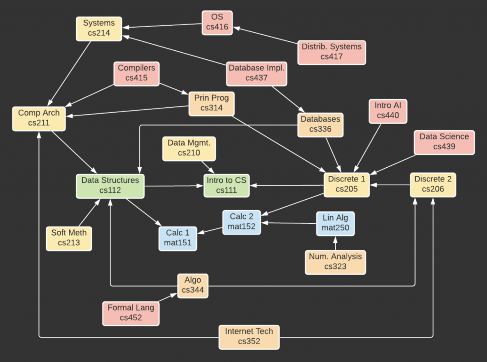

# Programming Assignment - Prerequisite Checker

The purpose of this assignment is to practice your understanding of directed graphs and the adjacency list graph storage.

**This assignment WILL TAKE A SUBSTANTIAL AMOUNT OF TIME TO COMPLETE.**

**Start your assignment early!** You need time to understand the assignment and to answer the many questions that will arise as you read the description and the code provided.

Refer to our [Programming Assignments FAQ](https://ds.cs.rutgers.edu/assignment-faq/) for instructions on how to install VSCode, how to use the command line and how to submit your assignments.

## Overview

Imagine (just for the sake of this assignment) that you are a student interested in the Rutgers Computer Science program. There are tons of courses available, many with prerequisites that need to be satisfied before they can be taken. It can get confusing to navigate what courses you need to take before other courses, and what courses are available to you given the courses you have already taken.

Luckily, you recognize that mapping out all the courses along with their prerequisites forms a DAG (Directed Acyclic Graph), or a graph with directed edges and no cycles.



> NOTE: This is not a perfect example model. The presented graph doesn't contain every CS course, just many popular ones. Additionally, it doesn't convey certain options like taking math 135 instead of 151 or taking cs211 as a corequisite to cs214.

Prerequisites are represented by a directed edge from the more advanced course to its prerequisite. For example, cs112 has an edge to cs111 since cs111 is a prerequisite to cs112. The way our model is set up, a course must have ALL of its prerequisites satisfied in order to be taken, which means all of a course's immediate neighbors (adjacent vertices) in the digraph must be completed. Note that while some advanced courses may not require a prerequisite directly, they may require a prerequisite indirectly. For example, cs211 only has cs112 as a direct prerequisite, but if you've taken cs211 you must have also taken cs111 and mat151. Thus, cs111 and mat151 are indirect prerequisites to cs211 and cs112 is a direct prerequisite. Connections to indirect prerequisites are implied and redundant, so they need not be stored in the graph.

## Implementation

### Overview of Files

-   We provide one Java class for each of the tasks you need to complete.
-   We provide `StdIn` and `StdOut`.
-   We provide one input file for each task. You are free to edit them, as well as create new input files with the correct format to help test your code.

### Implementation Notes

The structure of this assignment is quite different from the previous assignments.

-   **DO NOT** use `static` variables on your code.
-   In each given Java class, you will read from a given set of input files (passed in as command line arguments), and write to a given output file (passed in as a command line argument).
-   **DO NOT** change the names of the given Java files, or the project structure itself (do not change directory names or create new directories).
-   **DO NOT** remove the `package` statement from any of the given input files.
-   **DO NOT** use `System.exit()` in your code.
-   **YOU MAY** (and should) create your own classes in the `src/prereqchecker` folder. **YOU MAY** import `java.util.*`, but **DO NOT** import anything else. Make sure any new classes have a `package` statement:

    ```java
    package prereqchecker;
    ```

-   The classes that you create **MAY NOT** have spaces in their names.
-   In order to grade a problem, we run the corresponding Java class and verify the output file. This means you have full freedom in your project structure, as long as our provided classes output the correct answer to the correct output file. Take this opportunity to practice your project design skills, and write clean code that avoids redundancy.
-   **DO NOT** remove the `package` statement from the provided classes.

### Using `StdIn` and `StdOut`

-   Use `StdIn.setFile(fileName)` to set the current input file you want to read from.
-   You can now use methods like `StdIn.readInt()`, `StdIn.readString()` and `StdIn.readLine()` to operate on the input file as if it was standard input.
-   The methods `StdIn.readInt()` and `StdIn.readString()` actually leave the newline character unread, so if you use `StdIn.readLine()` after one of these methods, it will read this character rather than the next line. If you want to read the next line with `StdIn.readLine()`, you will need to call `StdIn.readLine()` once to read the newline character and then again to read the next line. `StdIn.readInt()` and `StdIn.readString()` ignore spaces and newlines by default.
-   Use `StdOut.setFile(fileName)` to set the current output file you want to write to. It creates the file if it doesn't already exist.
-   You can now use methods like `StdOut.print()` and `StdOut.println()` to operate on the output file as if it was standard output.
-   Autolab ignores empty lines and extra spaces that your output files may have.

## Tasks

### `AdjList`

This Java class will take two command line arguments in the following order:

1. An adjacency list input file name.
2. An output file name.

The input file will be formatted as follows:

-   An integer `a` (the number of courses)
-   `a` lines, each with a course ID (a string)
-   An integer `b` (the number of prereq connections)
-   `b` lines, each with a course ID, then one of its direct prerequisites (space separated)

Every course ID is guaranteed to NOT contain spaces or newlines

You will use this list of prereq connections to construct an adjacency list, then output it to the output file.

The output file will be formatted as follows:

-   `a` lines, where each line starts with a course ID and a space, then lists all the course's immediate prerequisites (space separated)
-   The order in which you output the lines, as well as the order in which you output the courses in each line after the first DOES NOT MATTER for grading.

Here is **one** example of a correct `adjlist.out` file obtained from running the [`AdjList.java`](src/prereqchecker/AdjList.java) file with the command line arguments `adjlist.in` and `adjlist.out` in that order.

```
cs437 cs336 cs214
cs415 cs211 cs314
cs206 cs205
cs416 cs214
mat151
mat250 mat152
cs417 cs416
mat152 mat151
cs439 cs205
cs352 cs206 cs211
cs440 cs205
cs111
cs452 cs344
cs210 cs111
cs112 cs111 mat151
cs211 cs112
cs344 cs206 cs112
cs213 cs112
cs323 mat250
cs214 cs211
cs314 cs211 cs205
cs336 cs112 cs205
cs205 cs111 mat152
```

### `ValidPrereq`

This Java class will take three command line arguments in the following order:

1. An adjacency list input file.
2. A prereq input file.
3. An output file.

The adjacency list input file will be formatted exactly as the one from `AdjList`.

The prereq input file will be formatted as follows:

-   1 line containing the ID for course 1
-   1 line containing the ID for course 2

You will use the graph described by the adjacency list input file to answer the following question about the courses: If course 2 was an immediate prerequisite for course 1, would all courses still be possible to take? (Remember, a course can only be taken once all its immediate prerequisites have been met). For example, adding cs111 as a prerequisite to cs211 is redundant, but doesn't cause any problems and all courses are still possible to take. Adding cs211 as a prerequisite to cs111 creates a situation where you cannot take cs111 OR cs211 OR anything in between, so all courses are no longer possible to take.

The output file will be formatted as follows:

-   One line, containing either `YES` or `NO`. `YES` if all courses are still possible to take for a new student, and `NO` otherwise.

Here is the correct `validprereq.out` file obtained from running the [`ValidPrereq.java`](src/prereqchecker/ValidPrereq.java) file with the command line arguments `adjlist.in`, `validprereq.in`, and `validprereq.out` in that order.

```
YES
```

### `Eligible`

This Java class will take three command line arguments:

1. An adjacency list input file.
2. An eligible input file.
3. An output file.

The adjacency list input file will be formatted exactly as the one from `AdjList`.

The eligible input file will be formatted as follows:

-   An integer `c` (the number of courses)
-   `c` lines, each with one course ID

Assume you have completed these `c` courses, all their prerequisites (both direct and indirect) and nothing else. What are all the courses that you are eligible to take now (and haven't taken yet)?

The output file will be formatted as follows:

-   For each course you are now eligible to take, output its course ID on its own line.
-   The order in which you output the course IDs DOES NOT MATTER for grading.

Here is **one** example of a correct `eligible.out` file obtained from running the [`Eligible.java`](src/prereqchecker/Eligible.java) file with the command line arguments `adjlist.in`, `eligible.in`, and `eligible.out` in that order.

```
mat250
cs210
cs213
cs214
cs205
```

### `NeedToTake`

This Java class will take three command line arguments in the following order:

1. An adjacency list input file.
2. A need to take input file.
3. An output file.

The adjacency list input file will be formatted exactly as the one from `AdjList`.

The need to take input file will be formatted as follows:

-   One line containing a course ID (target course)
-   An integer `d` (the number of taken courses)
-   `d` lines, each with one course ID (taken course)

Assume you have taken these `d` courses, all their prerequisites (both direct and indirect), and nothing else. What are all the courses that you have NOT taken yet, which are required in order to take the target course? In other words, what direct and indirect prerequisites of the target course have you not taken yet?

The output file will be formatted as follows:

-   For each course you need to take, output its course ID on its own line.
-   The order in which you output the course IDs DOES NOT MATTER for grading.

Here is **one** example of a correct `needtotake.out` file obtained from running the [`NeedToTake.java`](src/prereqchecker/NeedToTake.java) file with the command line arguments `adjlist.in`, `needtotake.in` and `needtotake.out` in that order.

```
cs214
cs336
cs205
```

### `SchedulePlan`

> Challenge Problem: 25 points extra credit!

This Java class will take three command line arguments in the following order:

1. An adjacency list input file.
2. A schedule plan input file.
3. An output file.

The adjacency list input file will be formatted exactly as the one from `AdjList`.

The schedule plan input file will be formatted as follows:

-   One line containing a course ID (target course)
-   An integer `e` (the number of taken courses)
-   `e` lines, each with one course ID (taken course)

Assume you have taken these `e` courses, all their prerequisites (both direct and indirect), and nothing else. Plan out a schedule such that you are eligible to take the target course in the FEWEST POSSIBLE number of semesters. Remember that you can't actually include a course in a semester until all its direct prerequisites were satisfied in previous semesters.

The output file will be formatted as follows:

-   An integer `f` (the number of semesters)
-   `f` lines, each with some number of space separated course ID's

**ANY VALID SCHEDULE which ends with you being able to take the target course will be accepted by the grader, as long as you utilize the minimum possible number of semesters.**

Here is **one** example of a correct `scheduleplan.out` file obtained from running the [`SchedulePlan.java`](src/prereqchecker/SchedulePlan.java) file with the command line arguments `adjlist.in`, `scheduleplan.in` and `scheduleplan.out` in that order. For an additional challenge, try to solve the problem with the restriction that you cannot take more than 3 courses per semester. This variation is SIGNIFICANTLY harder and will not be graded.

```
4
mat152 cs111
cs112 cs205
cs206
cs344
```

## Helpful Java Classes

The following are some data structures which are automatically imported with `java.util.*` that can help make your code cleaner and more efficient. You are free to not use any of these, and you are also free to use any other class under `java.util.*` as you see fit. I will not be covering every single method for these data structures, just some useful ones for this assignment. You can find more information about how to use these classes online.

-   [`ArrayList`](https://docs.oracle.com/en/java/javase/18/docs/api/java.base/java/util/ArrayList.html) is an ordered array-like structure with no size limit, as it automatically resizes.

    -   You can initialize an empty `ArrayList` named `name` which holds objects of type `Type` with

        ```java
        ArrayList<Type> name = new ArrayList<>();
        ```

        For example, an `ArrayList` of integers named `arrList` is initialized with

        ```
        ArrayList<Integer> arrList = new ArrayList<>();
        ```

    -   You can add a new element of type `Type` to the end of your `ArrayList` in average case `O(1)` time with

        ```java
        name.add(newElement);
        ```

    -   You can get the element at some index of your `ArrayList` in `O(1)` time with

        ```java
        name.get(index);
        ```

    -   You can set some index to some new element in `O(1)` time with

        ```java
        name.set(index, newElement);
        ```

    -   You can check if the `ArrayList` contains some element (returns a `boolean`) in `O(n)` time with

        ```java
        name.contains(element);
        ```

-   [`Queue`](https://docs.oracle.com/en/java/javase/18/docs/api/java.base/java/util/Queue.html) implements a FIFO structure.

    -   You can initialize an empty `Queue` named `name` which holds objects of type `Type` with

        ```java
        Queue<Type> name = new LinkedList<>();
        ```

        For example, a `Queue` of integers named `q` is initialized with

        ```java
        Queue q = new LinkedList<>();
        ```

    -   You can add a new element of type `Type` to the back of your `Queue` in `O(1)` time with

        ```java
        name.add(newElement);
        ```

    -   You can get the element at the front of the `Queue` with

        ```java
        name.peek();
        ```

    -   You can get and delete the element at the front of the queue with

        ```java
        name.remove();
        ```

-   [`HashMap`](https://docs.oracle.com/en/java/javase/18/docs/api/java.base/java/util/HashMap.html) is an unordered data structure which stores and retrieves key value pairs.

    -   You can initialize an empty `HashMap` named `name` that maps objects of type `Key` to objects of type `Value` with

        ```java
        HashMap<Key, Value> name = new HashMap<>();
        ```

        For example, a `HashMap` named `map` which maps strings to integers is initialized with

        ```java
        HashMap<String, Integer> map = new HashMap<>();
        ```

    -   You can add a new key value pair, or update an existing key with a new value in average case `O(1)` time with

        ```java
        name.put(key, value);
        ```

    -   You can check if the `HashMap` contains some key in average case `O(1)` time (returns a `boolean`) with

        ```java
        name.containsKey(key);
        ```

    -   You can check the value of some key in the `HashMap` in average case `O(1)` time with

        ```java
        name.get(key);
        ```

    -   You can iterate over all the keys in the `HashMap` with

        ```java
        for (Key key : name.keySet())
        ```

        where `Key` is the type of keys in the `HashMap`.

-   [`HashSet`](https://docs.oracle.com/en/java/javase/18/docs/api/java.base/java/util/HashSet.html) is an unordered data structure which only stores keys.

    -   You can initialize an empty `HashSet` named `name` that stores objects of type `Key` with

        ```java
        HashSet<Key> name = new HashSet<>();
        ```

        For example, a `HashSet` named `set` which stores strings is initialized with

        ```java
        HashSet<String> set = new HashSet<>();
        ```

    -   You can add a new key to the hash set in average case `O(1)` time with

        ```java
        name.add(key);
        ```

    -   You can check if a key exists in the hash set in average case `O(1)` time (returns a `boolean`) with

        ```java
        name.contains(key);
        ```

    -   You can remove a key in average case `O(1)` time with

        ```java
        name.remove(key);
        ```

    -   You can iterate over all the keys in the `HashSet` with

        ```java
        for (Key key : name)
        ```

        where `Key` is the type of keys in the `HashSet`.

## VSCode

-   You can run your program through VSCode or you can use the Terminal to compile and execute. We suggest running through VSCode because it will give you the option to debug.
-   [How to debug your code](https://code.visualstudio.com/docs/java/java-debugging)
-   If you choose the Terminal, from `PreReqChecker` directory/folder:

    -   To compile:

        ```
        javac -d bin src/prereqchecker/*.java
        ```

    -   To execute `AdjList`:

        ```
        java -cp bin prereqchecker.AdjList
        ```

## Before submission

-   Collaboration policy. Read our [collaboration policy here](https://ds.cs.rutgers.edu/#academic-integrity).

## Submission

-   Be careful when zipping the directory for submission.
-   **Autolab is expecting the exact directory organization we provided to you.**
-   Autolab is expecting the zip file to be named `prereqchecker.zip`
-   All files that you have written MUST be in the `PreReqChecker/src/prereqchecker` directory.

To zip the `PreReqChecker` directory navigate to the parent directory:

```console
$ zip -r prereqchecker.zip PreReqChecker
```

Inspect the zip by listing the files in zip without uncompressing it:

```console
$ unzip -l prereqchecker.zip
```

Your zip file must have the following structure:

```console
$ unzip -l prereqchecker.zip
Archive:  prereqchecker.zip
  Length      Date    Time    Name
---------  ---------- -----   ----
        0  2022-04-21 04:52   PreReqChecker/
        0  2022-04-21 04:30   PreReqChecker/src/
        0  2022-04-21 04:51   PreReqChecker/src/prereqchecker/
     9177  2022-04-20 23:46   PreReqChecker/src/prereqchecker/StdOut.java
     1494  2022-04-20 23:44   PreReqChecker/src/prereqchecker/SchedulePlan.java
     1338  2022-04-20 23:50   PreReqChecker/src/prereqchecker/NeedToTake.java
     1140  2022-04-21 04:43   PreReqChecker/src/prereqchecker/AdjList.java
     1390  2022-04-20 23:43   PreReqChecker/src/prereqchecker/ValidPrereq.java
    26262  2022-04-20 23:46   PreReqChecker/src/prereqchecker/StdIn.java
     1309  2022-04-20 23:50   PreReqChecker/src/prereqchecker/Eligible.java
       23  2022-04-20 18:54   PreReqChecker/needtotake.in
      614  2022-04-21 04:41   PreReqChecker/.project
       16  2022-04-20 18:54   PreReqChecker/eligible.in
      554  2022-04-20 18:54   PreReqChecker/adjlist.in
       16  2022-04-20 18:54   PreReqChecker/scheduleplan.in
        0  2022-04-21 04:30   PreReqChecker/.vscode/
     2586  2022-04-20 18:54   PreReqChecker/.vscode/launch.json
       74  2022-04-20 23:49   PreReqChecker/.vscode/settings.json
       12  2022-04-20 18:54   PreReqChecker/validprereq.in
        0  2022-04-21 04:43   PreReqChecker/bin/
        0  2022-04-21 04:46   PreReqChecker/bin/prereqchecker/
---------                     -------
    46005                     21 files
```

Submit `prereqchecker.zip` separately via the web submission system called Autolab. To do this, click the Assignments link from the course website; click the Submit link for that assignment.

## Getting help

If anything is unclear, don't hesitate to drop by office hours or post a question on Piazza. Find instructors office hours by clicking the [Staff](https://ds.cs.rutgers.edu/staff/) link from the course website. In addition to office hours we have the [CAVE](https://resources.cs.rutgers.edu/docs/rooms-equipment/cave/) (Collaborative Academic Versatile Environment), a community space staffed with lab assistants which are undergraduate students further along the CS major to answer questions.

## Credits

Problem by Ishaan Ivaturi
