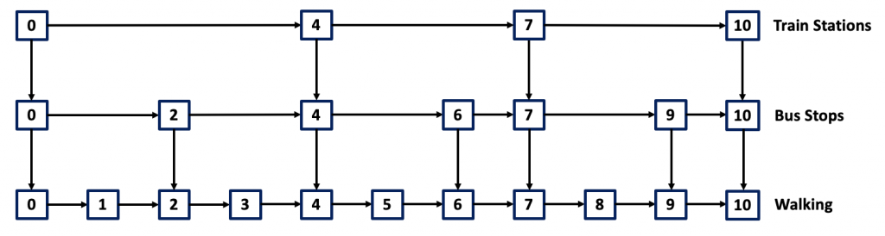
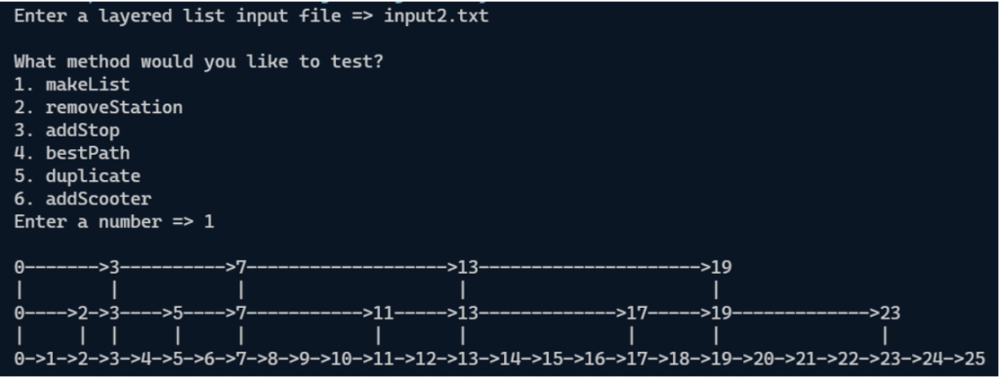
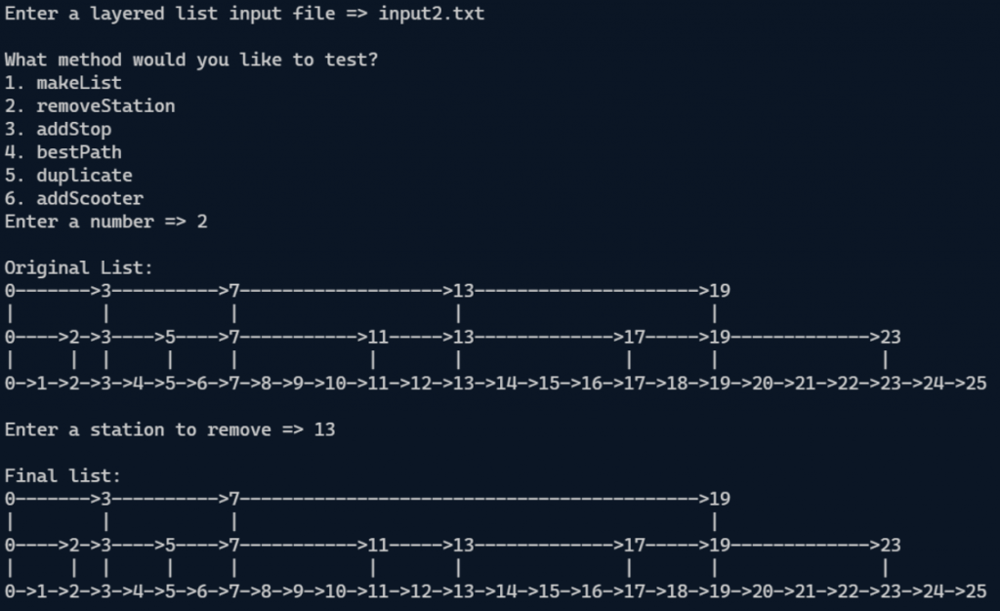
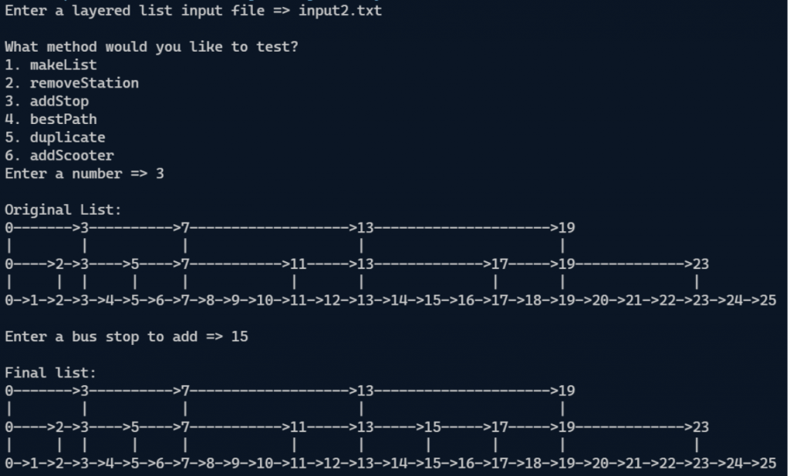
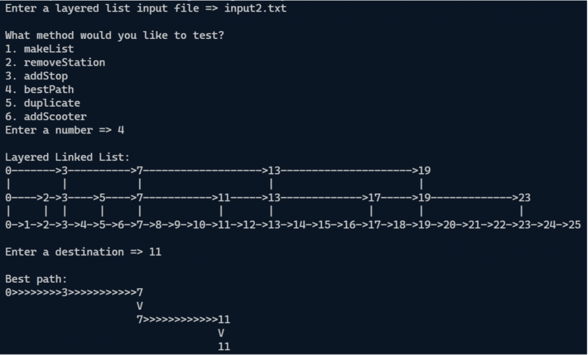
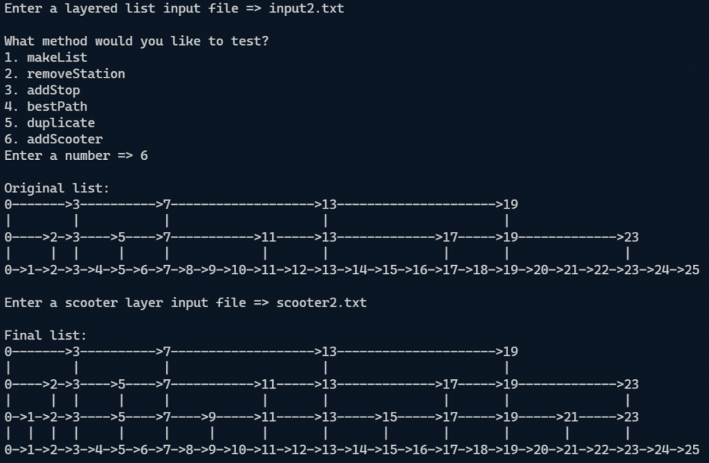

# Programming Assignment - Transit

The purpose of this assignment is to practice your understanding of linked structures.

Start your assignment early! **This assignment is substantially harder than the previous assignment.** You need time to understand the assignment and to answer the many questions that will arise as you read the description and the code provided.

Refer to our [Programming Assignments FAQ](https://ds.cs.rutgers.edu/assignment-faq/) for instructions on how to install VSCode, how to use the command line and how to submit your assignments.

## Overview

You've just moved into a new city, and you're planning your daily commute. You have 3 modes of public transportation available to you: the subway, the bus, and of course you can just walk. You can imagine locations in the city as a number line which increments from your starting location of `0` (zero). You can only move forward along this number line in your journey. The train is much faster than the bus, and the bus is much faster than walking. Unfortunately, the train can only stop at points where a train station exists, and the bus can only stop at points where a bus stop exists. You may assume that a bus stop exists at every train station, and that you may begin walking from any bus stop. You may walk forward and end your walking journey at any point.

## The Linked Structure



You plan and visualize your journey using a special 3 layered linked list.

-   The top layer represents the train, the middle layer represents the bus, and the bottom layer represents walking.
-   Each node in your layered linked list contains an `int` representing the `location`, a reference `next` representing the next location you can visit in your current mode of transport, and a reference `down` which takes you down to the SAME location in a slower mode of transport.
-   For example in the diagram below, the node `4` in the train layer points to the node `4` in the bus layer, which points to the node `4` in the walking layer. `next` will be set to `null` if there are no more locations to visit on the current mode of transport, and `down` will be set to `null` if you are in the walking layer.

## Implementation

### Overview of files provided

-   `TNode` class, which houses an `int` for `location`, and `next` and `down` pointers. Do not edit this class. It is not submitted, but it is used exactly as written to grade your code.
-   `Driver` class, which you can run to test any of your methods interactively. Feel free to edit this class, as it is provided only to help you test. It is not submitted, and it is not used to grade your code.
-   `StdIn` and `StdOut`, which are used by the driver. **Do not edit these classes.**
-   `Transit` class, that course `trainZero`, a reference to the zero node in the train layer. It also contains the methods that you are expected to fill in, followed by methods which are used by the driver. **Edit the empty methods with your solution, but DO NOT edit the provided ones.** This is the file you submit.
-   Multiple text files which contain input data, and can be read by the driver as test cases. Feel free to edit them or even make new ones to help test your code. They are not submitted.

### `Transit.java`

> NOTE: You are allowed (encouraged, even) to make helper methods in your `Transit.java` file to be used in your graded methods. Just make sure that they are created with the `private` keyword. Do not add new imports.

Methods to be implemented by you:

#### `makeList`

> Write this method first

-   This method builds your layered linked list structure. It takes in sorted integer arrays representing train stations, bus stops, and walking locations.
-   It is guaranteed that the bus array contains all values in the train array, and the walking array contains all values in the bus array. It is also guaranteed that the walking array contains every integer from 1 to its largest value.
-   **Every layer of your list should start with a node at location 0 (zero)**, and by following the next pointers, you should visit each value in the corresponding array. **Note that 0 (zero) will NOT be present in the input arrays**, and _you are responsible for adding zero nodes for each layer yourself_. Additionally, the nodes in the train layer should point down to the node in the bus layer of the same location, and the nodes in the bus layer should point down to the nodes in the walking layer of the same location.
-   Set `trainZero` to the zero node of the train layer (the topmost layer). Nothing should be returned.
-   You have been provided some input files to test this method ([`input1.txt`](input1.txt), [`input2.txt`](input2.txt), [`input3.txt`](input3.txt)). The format is as follows:
    -   One line containing the number of train stations
    -   One line containing the location of each train station, space separated
    -   One line containing the number of bus stops
    -   One line containing the location of each bus stop, space separated
    -   One line containing the number of walking locations
    -   One line containing each walking location, space separated

Below is an example of running the driver to help test this method.



#### `removeTrainStation`

-   Given an integer representing the location of a train station, write a method to remove the given train station from the layered linked list.
-   Note that the corresponding bus stop and walking location are NOT to be removed.
-   Perform your operations on the layered linked list referenced by the `trainZero` without returning anything.
-   If the specified train station doesn't exist, do nothing. The specified train stations used for grading are guaranteed to not be the zero node.
-   The input files to test this method are the same as `makeList`.

Below is an example of running the driver to help test this method.



#### `addBusStop`

-   Given an integer representing the location of a new bus stop, write a method to add the new bus stop to the layered linked list.
-   The bus stops used for grading are guaranteed to correspond to a walking layer node.
-   If the specified bus stop already exists, do nothing.
-   Perform your operations on the layered linked list referred by `trainZero` without returning anything.
-   The input files to test this method are the same as `makeList`.

Below is an example of running the driver to help test this method.



#### `bestPath`

-   Given an integer representing the destination location, determine the optimal path to get there.
-   Remember that you can only move forward or down through your layered list, and that you don't want to overshoot your destination in either the train or bus layers.
-   You want to stay on the train as long as you possibly can, then you want to stay on the bus as long as you possibly can, before walking to your destination.
-   Add every `TNode` along the best path to an `ArrayList`, ending in the destination node in the walking layer, returning this `ArrayList`.
-   The input files to test this method are the same as `makeList`.

Below is an example of running the driver to help test this method:



#### `duplicate`

-   Write this method to return a **deep copy** of the layered linked list referred by `trainZero`.
-   This means that the structure of the new list should be exactly the same, with the same values and connections in the train, bus, and walking layers.
-   It should be able to function exactly as the original list does. However, there should be NO nodes present in the copy which also exist in the original. In order for your deep copy to be graded as correct, every single node in it must have been created using the `new` keyword. **Return the zero node in the train layer of the deep copy.**
-   The input files to test this method are the same as `makeList`.

Below is an example of running the driver to help test this method:


#### `addScooter`

Your city has FINALLY added those new electric scooters (you may have even seen them around the Rutgers campus)!

-   You can't wait to try them, and you decide to try to add them to your daily commute.
-   You notice that the scooters can be picked up at any bus station and can be dropped off in slightly more locations, though they still can't get you to as many places as walking.
-   Naturally, you decide to implement this change to your commute as a "scooter layer" **underneath the bus layer but above the walking layer.**
-   Write a method which takes in a sorted integer array representing the locations in the scooter layer. Then update the layered linked list so that the bus layer points down to the correct nodes in the new scooter layer, and the new scooter layer points down to the correct nodes in the walking layer.
-   **Perform your operations on the layered list without returning anything.**
-   You have been provided some input files to help test this method ([`scooter2.txt`](scooter2.txt), [`scooter3.txt`](scooter3.txt)). The `scooter2` file should only be used with [`input2.txt`](input2.txt), and the `scooter3` file should only be used with [`input3.txt`](input3.txt). The format is as follows:
    -   One line containing the number of scooter stops
    -   One line containing all the locations of scooter stops, space separated

Below is an example of running the driver to help test this method:



## Implementation Notes

-   YOU MAY only update the methods `makeList()`, `removeTrainStation()`, `addBusStop()`, `addScooter()`, `bestPath()`, and `duplicate()`.
-   DO NOT add any instance variables to the `Transit` class.
-   DO NOT add any `public` methods to the `Transit` class.
-   YOU MAY add `private` methods to the `Transit` class.
-   DO NOT use `System.exit()`

## VSCode

### Executing and Debugging

-   You can run your program through VSCode or you can use the Terminal to compile and execute. We suggest running through VSCode because it will give you the option to debug.
-   [How to debug your code](https://code.visualstudio.com/docs/java/java-debugging)
-   If you choose the Terminal, navigate to the `Transit` directory:

    -   To compile:

        ```
        javac -d bin src/transit/*.java
        ```

    -   To execute:

        ```
        java -cp bin transit.Driver
        ```

## Before submission

-   Collaboration policy. Read our [collaboration policy here](https://ds.cs.rutgers.edu/#academic-integrity).
-   Submitting the assignment. Submit `Transit.java` separately via the web submission system called Autolab. To do this, click the `Assignments` link from the course website; click the `Submit` link for that assignment.

## Getting help

If anything is unclear, don't hesitate to drop by office hours or post a question on Piazza. Find instructors office hours by clicking the [Staff](https://ds.cs.rutgers.edu/staff/) link from the course website. In addition to office hours we have the [CAVE](https://resources.cs.rutgers.edu/docs/rooms-equipment/cave/) (Collaborative Academic Versatile Environment), a community space staffed with lab assistants which are undergraduate students further along the CS major to answer questions.

## Credits

Problem by Ishaan Ivaturi
