# Programming Assignment - Trie

In this assignment you will implement a tree structure called Trie (pronounced "Tree" or "Try"!).

## Rules

-  You will work on this assignment individually. Read the [DCS Academic Integrity Policy for Programming Assignments](https://www.cs.rutgers.edu/academics/undergraduate/academic-integrity-policy/programming-assignments) - you are responsible for abiding by the policy. In particular, note that "**All Violations of the Academic Integrity Policy will be reported by the instructor to the appropriate Dean**".
-  **IMPORTANT - READ THE FOLLOWING CAREFULLY!!!**

   Assignments emailed to the instructor or TAs will be ignored--they will NOT be accepted for grading. We will only grade submissions in Autolab.

   If your program does not compile, you will not get any credit.

   Most compilation errors occur for two reasons:

   1. You are programming outside Eclipse, and you delete the "package" statement at the top of the file. If you do this, you are changing the program structure, and it will not compile when we test it.
   2. You make some last minute changes, and submit without compiling.

   **To avoid these issues, (a) START EARLY, and give yourself plenty of time to work through the assignment, and (b) Submit a version well before the deadline so there is at least something in Autolab for us to grade.**

## Summary

You will write an application to build a tree structure called `Trie` for a dictionary of English words, and use the `Trie` to generate completion lists for string searches.

## Trie Structure

A Trie is a general tree, in that each node can have any number of children. It is used to store a dictionary (list) of words that can be searched on, in a manner that allows for efficient generation of completion lists.

The word list is originally stored in an array, and the trie is built off of this array. Here are some examples of word lists and the tries built to store the words, followed by an explanation of the trie structure and its relationship to its source word list.

### Trie 1

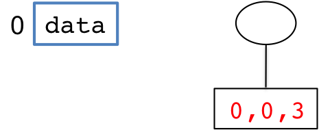

Root node is always empty. Child `[0,0,3]` of root stores `"data"` in a triplet `0` (for index of word in list), `0` (for position of first character, `'d'` in `"data"`) and `3` (for position of last character, `'a'`)

### Trie 2

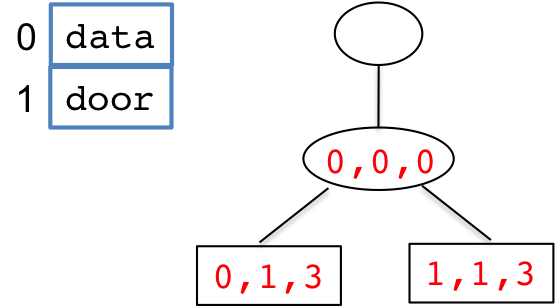

Child `(0,0,0) `of root stores common prefix `"d"` of its children `"data"` (left child) and `"door"` (right child), in triplet `0` (index of first word `"data"` in list), `0` (starting position of prefix `"d"`), and `0` (ending position of prefix `"d"`). Internal nodes represent prefixes, leaf nodes represent complete words. The left leaf node stores triplet `0` (first word in list), `1` (first index past the common prefix `"d"`, and `3` (last index in word). The right leaf node is stored similarly.

### Trie 3


Like in trie 2, child of root stores common prefix `"d"`, but this time left child is `"door"`, and right child is `"data"`, because `"door"` appears before `"data"` in the array.

### Trie 4

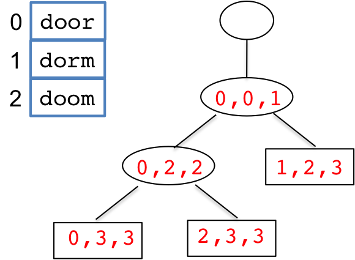

A node stores the longest common prefix among its children. Since `"do"` is the longest common prefix of all the words in the list, it is stored in the child of the root node as the triplet `(0,0,1)`. The left branch points to a subtree that stores `"door"` and `"doom"` since they share a common prefix "doo", while the right branch terminates in the leaf node for `"dorm"` stored as the triplet `1` (index of word `"dorm"`), `2` (starting position of substring `"rm"` following prefix `"do"`), and `3` (ending position of substring `"rm"`)

### Trie 5

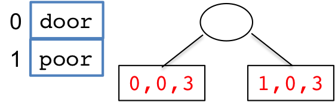

There is no common prefix in `"door"` and `"poor"`, so the root has 2 children, one for each word. (Common suffixes are irrelevant)

### Trie 6


There is no common prefix among all the words. But `"door"` and `"doom"` have a common prefix `"doo"`, while `"pore"` and `"port"` have a common prefix `"por"`.

### Trie 7


### Special Notes

-  Every leaf node represents a complete word, and every complete word is represented by some leaf node. (In other words, internal nodes do not represent complete words, only proper prefixes.)

-  No node, except for the root, can have a single child. In other words, every internal node has at least 2 children. Why? Because an internal node is a common prefix of several words. Consider these trees, in each of which an internal node has a single child (incorrect), and the equivalent correct tree:

### One-word trie Incorrect/Correct

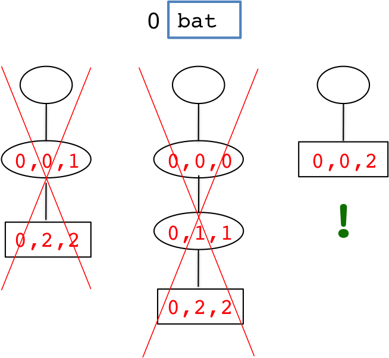

A single leaf node only.

### Two-word trie Incorrect/Correct

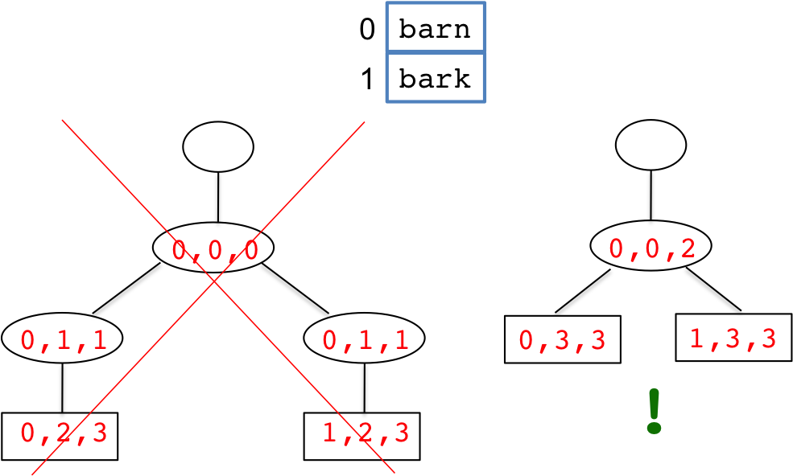

The longest common prefix of the two words is `"bar"`, so there is one internal node for this, with two branches for the respective trailing substrings

-  A trie does NOT accept two words where one entire word is a prefix of the other, such as `"free"` and `"freedom"`.

   (You will not come across this situation in any of the test cases for your implementation.)

-  The process to build the tree (described in the [Building a Trie](#building-a-trie) section below), will create a single child of the root for the longest common prefix `"free"`, and this node will have a single child, a leaf node for the word `"freedom"`. But this is an incorrect tree because it will (a) violate the constraint that no node aside from the root can have a single child, and (b) violate the requirement that every complete word be a leaf node (the complete word `"free"` is not a leaf node).


On the other hand, a tree with two leaf node children off the root node, one for the word `"free"` and the other for the word `"freedom"` will be incorrect because the longest common prefix MUST be a separate node. (This is the basis of completion choices when the user starts typing a word.)

## Data Structure

Since the nodes in a trie have varying numbers of children, the structure is built using linked lists in which each node has three fields:

-  substring (which is a triplet of indexes)
-  first child, and
-  sibling, which is a pointer to the next sibling.

Here's a trie and the corresponding data structure:

### Trie


### Data Structure


## Building a Trie

A trie is built for a given list of words that is stored in array. The word list is input to the trie building algorithm. The trie starts out empty, inserting one word at a time.

### Example 1

The following sequence shows the building of the above trie, one word at a time, with the complete data structure shown after each word is inserted.

#### Input and Initial Empty Tree


An empty trie has a single root node with `null` for all the fields.

#### After Inserting "door"


When `"door"` is inserted, a leaf node is created and made the first child of the root node. The substring triplet is `(0,0,3)`, since `"door"` is at index `0` of the word list array, and the substring is the entire string, from the first position `0` to the last position `3`.

#### After Inserting "dorm"

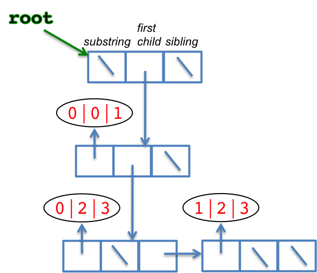

When `"dorm"` is inserted, its prefix `"do"` is found to match with prefix `"do"` in the existing word `"door"`. So the third value in the triplet for the existing node is changed from `3` to `1`, corresponding to the prefix `"do"`. (The word index--first value in triplet--is left unchanged.) And two new nodes are made at the next level for the two trailing substrings, `"or"` of `"door"` and `"rm"` of `"dorm"` - The array indexes of these words are in ascending order, i.e. `"door"` MUST come before `"dorm"` in the node sequence.


When `"doom"` is inserted, its prefix `"do"` is found to match with the entire substring stored at the child of the root. Descending further, the subsequent `"o"` is found to match with the prefix `"o"` of the substring `"or"` at the `(0,2,3)` node. This results in a modification of the `(0,2,3)` triplet to `(0,2,2)`, and the creation of a new level for the trailing substrings `"r"` and `"m"` of `"door"` and `"doom"`, respectively, in that order - `"door"` (word index `0` in array) MUST precede `"doom"` (word index `2`).

### Example 2

This shows the sequence of inserts in building [Trie 7](#trie-7) shown earlier.


#### Empty


#### After inserting "cat"

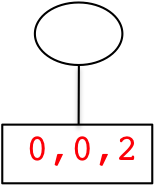

#### After inserting "muscle"

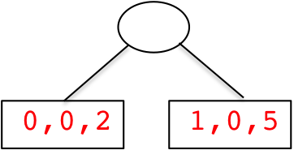

#### After inserting "pottery"


#### After inserting "possible"


#### After inserting "possum"

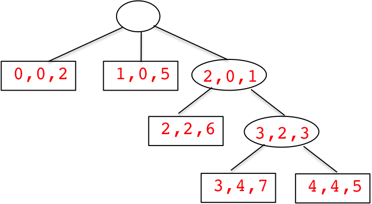

#### After inserting "musk"

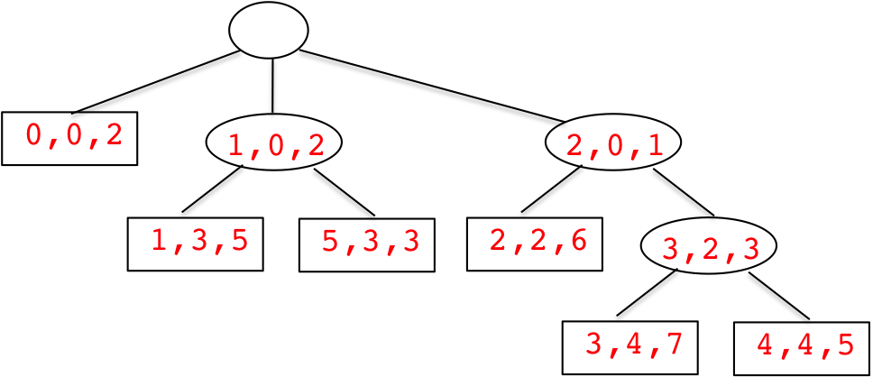

#### After inserting "potato"


#### After inserting "muse"


## Prefix Search

Once the trie is set up for a list of words, you can compute word completions efficiently.

For instance, in the trie of [Example 2](#example-2) above (`cat`, `muscle`, ...),suppose you wanted to find all words that started with `"po"` (prefix). The search would start at the root, and touch the nodes `[0,0,2],(1,0,2),(2,0,1),(2,2,2),(3,2,3),[2,3,6],[6,3,5],[3,4,7],[4,4,5]`. The nodes `[2,3,6],[6,3,5],[3,4,7],[4,4,5]` are the ones that hold words that begin with the given prefix.

Note that NOT ALL nodes in the tree are examined. In particular, after examining `(1,0,2)`, the entire subtree rooted at that node is skipped. This makes the search efficient. (Searching all nodes in the tree would obviously be very inefficient, you might as well have searched the word array in that case, why bother building a trie!)

## Implementation

You will see a project called `Trie` with the following classes in the `trie` package: `TrieNode`, `Trie`, and `TrieApp`.

There are also a number of sample test files of words directly under the project folder (see the [Testing](#testing) section that follows.)

You will implement the following methods in the `Trie` class:

-  (50 pts) `buildTrie`: Starting with an empty trie, builds it up by inserting words from an input array, one word at a time. The words in the input array are all lower case, and comprise of letters ONLY.
-  (30 pts) `completionList`: For a given search prefix, scans the trie efficiently, gathers and returns an `ArrayList` of references to all leaf `TrieNodes` that hold words that begin with the search prefix (you should NOT create new nodes.) For instance, in the trie of [Example 2](#example-2) above, for search prefix `"po"` your implementation should return a list of references to these trie leaf nodes:

   ```
   [2,3,6],[6,3,5],[3,4,7],[4,4,5]
   ```

   NOTE:

   -  The order in which the leaf nodes appear in the returned list does not matter.
   -  You may NOT search the words array directly, since that would defeat the purpose of building the trie, which allows for more efficient prefix search. See the [Prefix Search](#prefix-search) section above. If you search the array, you will NOT GET ANY credit, even if your result is correct.
   -  If your prefix search examines unnecessary nodes (see [Prefix Search](#prefix-search) section above), you will NOT GET ANY credit, even if your result is correct.

Make sure to read the comments in the code that precede classes, fields, and methods for code-specific details that do not appear here. Also, note that the methods are all static, and the `Trie` has a single private constructor, which means NO `Trie` instances are to be created - all manipulations are directly done via `TrieNode` instances.

You may NOT MAKE ANY CHANGES to the `Trie.java` file EXCEPT to (a) fill in the body of the required methods, or (b) add private helper methods. Otherwise, your submission will be penalized.

You may NOT MAKE ANY CHANGES to the `TrieNode` class (you will only be submitting `Trie.java`). When we test your submission, we will use the exact same version of `TrieNode` that we shipped to you.

## Testing

You can test your program using the supplied `TrieApp` driver. It first asks for the name of an input file of words, with which it builds a trie by calling the `Trie.buildTree` method. After the trie is built, it asks for search prefixes for which it computes completion lists, calling the `Trie.completionList` method.

Several sample word files are given with the project, directly under the project folder. ([words0.txt](words0.txt), [words1.txt](words1.txt), [words2.txt](words2.txt), [words3.txt](words3.txt), [words4.txt](words4.txt)). The first line of a word file is the number of the words, and the subsequent lines are the words, one per line.

There's a convenient print method implemented in the `Trie` class that is used by `TrieApp` to output a tree for verification and debugging ONLY. Our testing script will NOT look at this output - see the Grading section below.

When we test your program:

-  Words will ONLY have letters in the alphabet.
-  All words--for building the trie as well as for prefix searches--will be input in lower case.
-  We will NOT input duplicate words.
-  We will NOT input two words such that one is a prefix of the other, as in `"free"` and `"freedom"`, i.e. a complete word will not be a prefix of another word.

### Running `TrieApp`

Here are a couple of examples of running `TrieApp`:

The first run is for [words3.txt](words3.txt):

```
Enter words file name => words3.txt

TRIE

 ---root
     |
          doo
     ---(0,0,2)
         |
              door
         ---(0,3,3)
         |
              doom
         ---(3,3,3)
     |
          por
     ---(1,0,2)
         |
              pore
         ---(1,3,3)
         |
              port
         ---(2,3,3)

completion list for (enter prefix, or 'quit'): do
door,doom

completion list for: quit
```

The second run is for [words4.txt](words4.txt):

```
Enter words file name => words4.txt

TRIE

 ---root
     |
          cat
     ---(0,0,2)
     |
          mus
     ---(1,0,2)
         |
              muscle
         ---(1,3,5)
         |
              musk
         ---(5,3,3)
     |
          po
     ---(2,0,1)
         |
              pot
         ---(2,2,2)
             |
                  pottery
             ---(2,3,6)
             |
                  potato
             ---(6,3,5)
         |
              poss
         ---(3,2,3)
             |
                  possible
             ---(3,4,7)
             |
                  possum
             ---(4,4,5)

completion list for (enter prefix, or 'quit'): pos
possible,possum

completion list for: mu
muscle,musk

completion list for: pot
pottery,potato

completion list for: quit
```

Try these tests with your implementation - your `Trie` printout MUST look IDENTICAL to the above. If your tree looks different, either your program logic is incorrect, or there is something different in the sequence of word inserts. In either case, you will not get any credit, so make sure you fix your code.

Also try the other sample word files. AND, try with word files of your own, formatted exactly like the sample word files - first line is number of words, then one word per subsequent line.

Go over the `TrieApp` code to understand how the `Trie` methods are called, and how the returned array list from completionList is processed to actually print the completion words.

## Submission

Submit your `Trie.java` file.

## Grading

The `buildTrie` method will be graded by comparing the tree structure resulting from your implementation, with the correct tree structure produced by our implementation. We will NOT be looking at the printout of the tree, the print method in the `Trie` class (used by `TrieApp` as in the above test examples) is for your convenience only.

The `completionList` method will be graded by inputting prefix strings to some of the trees created in `buildTrie`. However, these trees will be created by our correct implementation of `buildTrie`. In other words, to test your `completionList` implementation, we will NOT use your `buildTrie` implementation at all. This is fully for your benefit, because if your `buildTrie` implementation is incorrect, it will not adversely affect the credit you get for your `completionList` implementation. We will also make sure that the nodes you return belong to the `Trie`, and not some independent nodes you created outside of the `Trie`.
