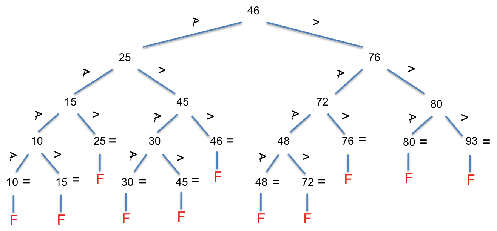

# Problem Set 5 - Sequential Search, Binary Search

## Problem 1

Given the following sequence of integers:

```
3, 9, 2, 15, -5, 18, 7, 5, 8
```

1. What is the average number of comparisons for a successful search assuming all entries are searched with equal probability? Show your work.
2. Suppose the search probabilities for the elements of this list are, respectively:

   ```
   0.1, 0.3, 0.05, 0.2, 0.05, 0.1, 0.05, 0.1, 0.05
   ```

   What is the average number of comparisons for successful search with these search probabilities? Show your work.

3. Rearrange the list entries in a way that would result in the lowest number of comparisons on the average for successful search, given the above probabilities of search. What is this lowest number of comparisons? Show your work.

### Problem 1 Solution

-  In a sequential search of a list, it takes one comparison to succeed at the first element, two comparisons to succeed the second element, and so on. In general it takes i comparisons to succeed at the `i`-th element. With the assumption that all entries are searched with equal probability, the formula is:
   ```
   (1 + 2 + 3 + 4 + ... + n) / n = n * (n + 1) / (2 * n) = (n + 1) / 2 = (9 + 1) / 2 = 5
   ```
-  If the search probabilities are changed according to the given example, the average # of comparisons should be computed as follows:
   ```
   0.1 * 1 + 0.3 * 2 + 0.05 * 3 + 0.2 * 4 +
   0.05 * 5 + 0.1 * 6 + 0.05 * 7 + 0.1 * 8 + 0.05 * 9 = 4.1
   ```
-  We should rearrange the entries such that entries with high search probabilities come first in the list. For example the entry "9" should be the first item since it has the highest search probability. Following this procedure, the new list should be arranged like this:
   ```
   9 15 {3,5,18} {2,-5,7,8}
   ```
   The entries in the brackets can be arranged in an arbitrary order since they have the same search probabilities.

## Problem 2

An adaptive algorithm to lower average match time for sequential search is to move an item by one spot toward the front every time it is matched. (Unless it is already at the front, in which case nothing is done on a match.) Complete the following modified sequential search on a linked list with this move-toward-front adaption. Assume a generic `Node` class with `data` and `next` fields.

```java
public class LinkedList<T> {
   private Node<T> front;
   int size;

   // ...

   // moves the target one place toward the front
   // doesn't do anything if target is in the first node
   // returns true if target found, false otherwise
   public boolean moveTowardFront(T target) {
      // COMPLETE  THIS METHOD
   }
}
```

### Problem 2 Solution

```java
public boolean moveTowardFront(T target) {
   Node ptr = front, prev = null;
   while (ptr != null) {
      if (ptr.data.equals(target)) {
         break;
      }
      else {
         prev = ptr;
         ptr = ptr.next;
      }
   }
   if (ptr == null) {  // not found
      return false;
   }
   if (prev == null) { // front node, do nothing
      return true;
   }
   // switch with previous
   T temp = prev.data;
   prev.data = ptr.data;
   ptr.data = temp;
   return true;
}
```

## Problem 3

Draw the comparison tree for binary search on a sorted array of length 11.

1. What is the worst case number of comparisons for success? For failure?
2. What is the average number of comparisons for success, assuming equal likelihood of success at any spot?
3. What can you say about the average number of comparisons for failure? Can you approximate it within a small range? Does it depend on the distribution of the probabilities of failing at the various failure spots?

### Problem 3 Solution

For the comparison tree, the nodes have the index positions where comparisons are made:

```
              (5) =
       < /           \ >
    = (2)             (8) =
   < /   \ >       < /   \ >
= (0)     (3) =  = (6)     (9) =

< / \ > < / \ >  < / \ > < / \ >
 F (1)=  F (4)=   F (7)=  F (10)=
  < /\ >  < /\ >  < /\ >   < /\ >
   F  F    F  F    F  F     F  F
```

1. Worst case #comparisons for success = 7 (for positions 1, 4, 7, 10), worst case #comparisons for failure = 8 (for failures off the positions 1, 4, 7, 10).
2. Average #c for success = `(1 * 1 + 2 * 3 + 4 * 5 + 4 * 7) / 11 = 5`.
3. It would take 6 comparisons to get to any of the failure nodes at the last but one level, and 8 comparisons for the last. So the average MUST be between 6 and 8, no matter what the probability distribution is over all of these possibilities.

## Problem 4

`*` A variant of binary search, called lazy binary search, works as described in the following algorithm, where `t` is the target to search, and `n` is the size of the array:

```
left <-- 0
right <-- n-1
while (left < right) do
   mid <-- (left + right) / 2
   if (t > A[mid]) then
      left <-- mid + 1
   else
      right <-- mid
   endif
endwhile

if (t == A[left]) then
   display "found at position", left
else
   display "not found"
endif
```

1. Trace this algorithm on the following array, with `46` as the search target:
   ```
   10   15   25   30   45   46   48   72   76   80   93
   ```
   How many comparisons are made by the time a match is found? How does your answer compare with that for regular binary search?
2. Repeat with `40` as the target. How many comparisons are made until failure is detected? How does your answer compare with that for regular binary search?
3. Draw the comparison tree for lazy binary search on an array of length 11 (same length as the example array above).
   1. What is the worst case number of comparisons for success? For failure?
   2. What can you say about the range of values for the average number of comparisons for success? For failure?
   3. Under what conditions is it preferable to use lazy binary search over the regular binary search?

### Problem 4 Solution

1. Trace this algorithm on the following array, with `46` as the search target:

   ```
   10   15   25   30   45   46   48   72   76   80   93
   ```

   How many comparisons are made by the time a match is found? How does your answer compare with that for regular binary search?

   **ANSWER**

   4; while it takes 1 for regular binary search.

2. Repeat with 40 as the target. How many comparisons are made until failure is detected? How does your answer compare with that for regular binary search?

   **ANSWER**

   5; while it takes 8 for regular binary search.

3. Draw the comparison tree for lazy binary search on an array of length 11 (same length as the example array above).

   **ANSWER**

   Actual values in the array are used instead of the index positions, for better clarity.

   

   Note that the comparison `t > A[mid]` is labeled on the right branch, and its flip (`≯`) is labeled on the left branch, instead of against the `A[mid]` value itself because this makes for easier counting as you descend the tree. (Only one comparison is actually made, so that whether you take the left or right branch, you will only count one comparison.) Also, for the comparison `t == A[left]` after exiting the loop, the comparison is marked against the value in the tree, and the flip side of this comparison will result in falling through to the failure node.

   1. What is the worst case number of comparisons for success? For failure?

      **ANSWER**

      Worst case #comparisons for success = 5, same for failure

   2. What can you say about the range of values for the average number of comparisons for success? For failure?

      **ANSWER**

      Success happen at the last second-to-last and the third-to-last levels. For any success node in the second-to-last level the number of comparisons is 5, and for the third-to-last level is 4. So the average MUST be in the range 4 to 5.

      Failure happens at the last and second-to-last levels. For any failure node in the last level the number of comparisons is 5, and for the second-to-last level is 4. So the average MUST be in the range 4 to 5.

   3. Under what conditions is it preferable to use lazy binary search over the regular binary search?

      **ANSWER**

      Lazy binary search is better when there are more failures than successes since failures take fewer comparisons on average. While matches at certain positions now take longer to get to, the average number of comparisons is reduced since the new tree is less than double the height of the old, but the number of comparisons is halved. So, in sum, lazy binary search reduces the average number of comparisons for both successes and failures, and it levels the playing field over successes and failures.

## Problem 5

An alternative algorithm for searching on a sorted array of size `n` works as follows. It divides the array into `m` contiguous blocks each of size `s`. (Assume that `s` divides into `n` without remainder).

Here is the algorithm to search for a key `k` in sorted array `A`.

```
Compare k with the last entry in the first block, i.e. A[s - 1]
If there is match, then stop with success

Otherwise, check if k < A[s - 1].
If so, perform a sequential search on the block of entries from A[0] to A[s - 2]. 
If there is a match, stop with success, otherwise stop with failure.

If k is not < A[s - 1], then continue the process by repeating the above on the second block, and so on.
```

1. What is the worst case number of searches for success?
2. `**` What is the average case number of searches for success?

### Problem 5 Solution

1. What is the worst case number of searches for success?

   **ANSWER**

   In the worst case, the last entry of every block is checked, and finally, a sequential search is performed in the last block. A total of `2m` comparisons are made before the sequential search in the last block: 2 comparisons per last entry of each the `m` blocks. Then, the sequential search in the last block makes `s - 1` comparisons. Total comparisons = `2m + s -1`.

2. `**` What is the average case number of searches for success?

   **ANSWER**

   Compute the number of comparisons for each match, and then divide by number of entries.

   For first block matches:

   | item          | compares  |
   | ------------- | --------- |
   | `last`        | `1`       |
   | `first`       | `3`       |
   | `second`      | `4`       |
   | `...`         |           |
   | `second last` | `(s + 1)` |

   For second block matches: Before getting to the last item in the block, 2 comparisons (against the last item in the previous block). Then, within the block, the pattern is the same as in the previous table, so:

   | item          | compares        |
   | ------------- | --------------- |
   | `last`        | `1 (+ 2)`       |
   | `first`       | `3 (+ 2)`       |
   | `second`      | `4 (+ 2)`       |
   | `...`         |                 |
   | `second last` | `(s + 1) (+ 2)` |

   For third block: Before getting to the last item in the block, 4 comparisons (2 comparisons against the last item in the 1st block, then 2 comparisons against the last item in the 2nd block.) Then, within block same as before, so:

   | item          | compares        |
   | ------------- | --------------- |
   | `last`        | `1 (+ 4)`       |
   | `first`       | `3 (+ 4)`       |
   | `second`      | `4 (+ 4)`       |
   | `...`         |                 |
   | `second last` | `(s + 1) (+ 4)` |

   So, the total looks like this:

   ```
   (1 + 3 + 4 + 5 + ... + (s+1))                 [1st block]
   +   (1 + 3 + 4 + 5 + ... + (s+1)) + 2 * s     [2nd block, 2 added to each of the s items]
   +   (1 + 3 + 4 + 5 + ... + (s+1)) + 4 * s     [3rd block, 4 added to each of the s items]
   +    ....
   +   (1 + 3 + 4 + 5 + ... + (s+1)) + 2 * (m - 1) * s
   ```

   Let the above sum be `T`. The average number of comparisons would be `T/n`. We can simplify `T` as follows.

   Let's first take the series:

   ```
   S = 1 + 3 + ... + (s + 1)
   ```

   We can transform this to:

   ```
   S = [1 + 2 + 3 + ... + ( s + 1)] - 2
   ```

   Adding a 2 makes it an arithmetic series from 1 to `(s + 1)`, and we take away the 2 to compensate. This simplifies to:

   ```
   S = (s + 1)(s + 2) / 2 - 2
   ```

   `S` occurs `m` times in `T` (once per block). So this component of `T` sums to:

   ```
   m[(s + 1)(s + 2) / 2-2]
   ```

   Now let's look at the other component of `T`, which is:

   ```
   2s + 4s + ... + 2(m-1)s = 2s[1 + 2 + ... + (m-1)] = 2sm(m - 1) / 2 = n(m - 1)
   ```

   So now we have:

   ```
   T = m[(s + 1)(s + 2) / 2 - 2] + n(m - 1)
     = m[(s^2 + 3s + 2) / 2 -2] + n( m - 1)
     = (ms * s + 3ms + 2m) / 2 - 2m + n(m - 1)
     = ns / 2 + 3n / 2 + m - 2m + nm - n
     = ns / 2 + n / 2 - m + nm
   ```

   So average

   ```
   T/n = s/2 + 1/2 - m/n + m
   ```
